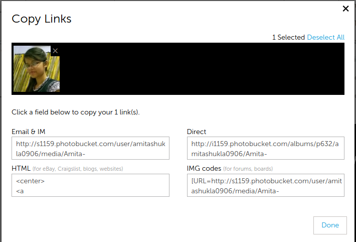

In this post we talk about how to host images on the web so that it can be viewed by everybody. 


As I was developing my blog, I had to post my photograph for the 'About Me' section.

I went on to write my content as: 
 

```html
 <div class=\"textwidget\">
  <br />
 <br />
 Hello I am <strong>Amita Shukla</strong>...blah blah blah... This blog is a

 place where I want to share all the things that I learn every now and then.

 blah blah blah...<br />
 <center> </center>
 </div>
```
 
The main problem here was the attribute '**src**'. For displaying the image, I needed it to host somewhere on the web, so that I can provide the link here.

#### The Failed Attempt

The main problem here was the attribute 'src'. For displaying the image, I needed it to be hosted somewhere on the web, so that I can provide the link here. 
The first idea was Google Drive. I uploaded the image, and acquired the shareable link. But, as I placed the link, an **aria-hidden**tag was automatically put, set to **true**. This tag automatically made the image hidden for public viewing. 


 


#### [Photobucket](http://s1159.photobucket.com/) paved the way!

I decided to try Photobucket, and quickly created an account.

It has a very nice and clean interface. I uploaded the image. As soon as I selected the image, a few options flashed below in blue.

One of the options was 'Links'.

Clicking on the option provided me with the links that can be hosted on several interfaces, such as Email,IM, Blogs, HTML, Forums etc. 
 




 


 
I quickly clicked on the HTML option that handed me with the following code:

 


```html
 <center>
 <a href=\"http://s1159.photobucket.com/user/amitashukla0906/media/Amita-Shukla_

 zpsxjmxhbdt.jpg.html\" target=\"_blank\"></a>
 </center>

``` 


 


Thanks PhotoBucket!
