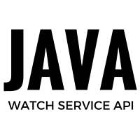

While I was making my [File Scanner Project](https://github.com/amita-shukla/file-scanner), the most initial task was to set a watch over given property files. If any change occurred in any of the properties files, it had to be reported. 
 

 
 
You may have seen this functionality in the form of 'file change notification'. Suppose you are writing a program, and the file is modified by some other program. You then see a notification saying to load the changes. 
Another time it may happen that you are working on a project with several files and any change in a file in the same project prompts a notification that a file is changed. 
 
To make this functionality, we need to keep a regular watch over the directory. One way we can think of is that we can poll the directory (file system) from time to time to record any changes. 
 
But the API that comes to our rescue is Watch Service API, in java.nio.file package. 
 

### How does Watch Service API work?

When a watch service is initiated, a separate thread is launched that keeps track of the changes in the specified directory.

From the main(), I call a method called runWatch(). This initiates the whole process.

 

As you can see I call a method of the WatchDir class. 
The WatchDir class contains the functionalities needed for watching over the directory. 
In the constructor, we can initiate the 'watcher'. The watcher is nothing but an instance of WatchService API, that will do the job for us. 
 
 

 
The register() assigns the watcher. Other events can also be specified, such as 
 

- ENTRY_CREATE
- ENTRY_DELETE
- OVERFLOW

Next is the processEvents(). This method creates an infinite loop which polls for events and as and when they happen, it reports them.

 

 

 

The processing events are described aptly in the Oracle WatchService API tutorial :

 

The order of events in an event processing loop follow:

> 1. Get a watch key. Three methods are provided:
>
> - [`poll`](https://docs.oracle.com/javase/8/docs/api/java/nio/file/WatchService.html#poll--) – Returns a queued key, if available. Returns immediately with a `null` value, if unavailable.
> - [`poll(long, TimeUnit)`](https://docs.oracle.com/javase/8/docs/api/java/nio/file/WatchService.html#poll-long-java.util.concurrent.TimeUnit-) – Returns a queued key, if one is available. If a queued key is not immediately available, the program waits until the specified time. The`TimeUnit` argument determines whether the specified time is nanoseconds, milliseconds, or some other unit of time.
> - [`take`](https://docs.oracle.com/javase/8/docs/api/java/nio/file/WatchService.html#take--) – Returns a queued key. If no queued key is available, this method waits.
>
> 2. Process the pending events for the key. You fetch the `List` of [`WatchEvents`](https://docs.oracle.com/javase/8/docs/api/java/nio/file/WatchEvent.html)from the [`pollEvents`](https://docs.oracle.com/javase/8/docs/api/java/nio/file/WatchKey.html#pollEvents--) method.
>
> 3. Retrieve the type of event by using the [`kind`](https://docs.oracle.com/javase/8/docs/api/java/nio/file/WatchEvent.html#kind--) method. No matter what events the key has registered for, it is possible to receive an `OVERFLOW` event. You can choose to handle the overflow or ignore it, but you should test for it.
>
> 4. Retrieve the file name associated with the event. The file name is stored as the context of the event, so the [`context`](https://docs.oracle.com/javase/8/docs/api/java/nio/file/WatchEvent.html#context--) method is used to retrieve it.
>
> 5. After the events for the key have been processed, you need to put the key back into a `ready` state by invoking [`reset`](https://docs.oracle.com/javase/8/docs/api/java/nio/file/WatchEvent.html#reset--). If this method returns `false`, the key is no longer valid and the loop can exit. This step is very **important**. If you fail to invoke `reset`, this key will not receive any further events.

 
When an event occurs, we can either print the result using System.out.println , or call another function that takes these values further and does whatever else we may want. 
For example, in this project, I have transferred the file name and the event type, which passes these values to another object to further work on it. 
 
So, we are done! You might get overwhelmed thinking about the complexity of the task, but it's quite simple as we dig into it. 
 
Here is the complete code of WatchDir class that handles Watch Service API. 
 
 

You can get the code and project [here](https://github.com/amita-shukla/file-scanner/blob/master/src/WatchDir.java) at GitHub. 
 
 
_Want to suggest edits? Get this post on Github : <https://github.com/amita-shukla/blog/blob/master/21WatchService.md>_

_Want to view how I tackled other problems in other projects? Check Out : <http://shuklaamita.blogspot.in/2016/02/implement-own-session-mechanism-java.html>_
 
EDIT (26/06/2016) : Image added

