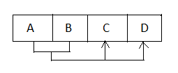
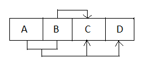
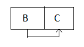
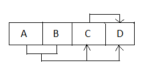
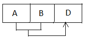
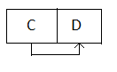

In my previous [post](http://shuklaamita.blogspot.in/2016/06/relational-database-functional-dependencies-canonical-cover-keys.html), we discussed Relational Database Design. To store data effectively, we must ensure that the data is non-redundant. This reduces conflicts. But how to design such a database that the conflicts are reduced? The answer lies in Normalization. 
 
 
A database designed keeping in mind normalization techniques leads to a more robust design and avoid the problems that can crop up later. This design is viewed in terms of Functional Dependencies, that we studied in the previous post. 
Remember that a relation containing only 2 attributes is always normalized. 
 
Let's start now. 
 

### First Normal Form

The first states a simple rule : If all attributes in a relation are atomic, then the relation is in First Normal Form. 

#### What does it mean for an attribute to be atomic?

An atomic attribute means that the values of that attribute can not be further divided. 
 
Suppose a relation has an attribute called 'Name'. Now, a name can have sub-attributes like First Name, Middle Name, and Last Name. In this case, instead of having one attribute, we should divide it into separate attributes. Therefore, we should delete the attribute 'Name' and place 3 attributes : 'First Name', 'Middle Name' and 'Last Name'. 
 
 

### Second Normal Form

Any relation is said to be in Second Normal Form:

- if it is in First Normal Form, and
- all non-prime attributes are fully, functionally dependent on the candidate key.

To check if a relation is in Second Normal Form,

- find the Candidate Key. To know how to find candidate key in a relation, check my previous post :[Relational Database Design](http://shuklaamita.blogspot.in/2016/06/relational-database-functional-dependencies-canonical-cover-keys.html)
- Find **Prime attributes**. Prime Attributes are those attributes that comprise a candidate key. So, if a Relation(ABC) has AB as its primary key, then A and B are prime attributes.
- Find **Non-Prime attributes**. All those attributes that are not prime are non-prime attributes (that was simple :D) . Hence, as in the above example, C is a non-prime attribute.

Let's elaborate on what is a fully functional dependency before moving further.

#### Fully Functional Dependency

For an FD to be fully functional, any subset of the candidate key (i.e. the prime attributes) should not determine any non-prime attribute.If so happens, it is called as**Partial Dependency**.

 

Consider the following diagrams for a relation R(ABCD), here the arrows represent dependency.

| ------------------------------------------------------------------------------------------------------------------------------------------------------------------------------------------------------------------------------------------------------------------------------------------------------------- |
| Fully Functional Dependency |

 

| ----------------------------------------------------------------------------------------------------------------------------------------------------------------------------------------------------------------------------------------------------------------------------------- |
| Partial Dependency |

 

 

You might think, what if one non-prime attribute determines another non-prime attribute? Wait wait. We will get to that.

 

But first, we must discuss what should be done if we find a relation that is not in 2 NF.

#### Decomposing a relation into 2NF

A relation can be decomposed into multiple relations in 2NF. The partial dependencies with the same attribute on the left are combined together to form a separate relation. Consider the following diagram:

 

 

Here,

AB →C : full

AB →D : full

B →C : partial

 

Therefore R(AB, C, D ) can be decomposed into:

R1(AB, C, D) \[Primary Key: AB]

R2(B, C) \[Primary Key : B]

 

| ------------------------------------------------------------------------------------------------------------------------------------------------------------------------------------------------------------------------------------------------------------------------------------------------------------- |
| R1 in 2 NF |

 

| ----------------------------------------------------------------------------------------------------------------------------------------------------------------------------------------------------------------------------------------------------------------------------------- |
| R2 in 2NF |

 

Note that when the candidate key contains a single attribute, the need for looking up for full or partial dependencies is eliminated, as no subset of the candidate key is possible.

Hence, such a relation is automatically in 2NF. You can **save** yourself from all the above analysis :P

 

### Third Normal Form

A relation is in 3NF if it is in 2NF and all non-prime attributes are non-transitively dependent on candidate key.

Consider the following diagram for a relation R(ABCD) with FDs:

AB→C

AB→D

C →D

 

Here C is said to be transitively dependent on D. You can take it as, D has two owners: C, and AB. This can cause conflict in the schemas, at the time of insertion, deletion or updation.

 

The wait ends here. The above diagram is very well in 2nd Normal Form but violates the rule of the Third Normal Form.

 

#### Decomposition of a relation into 3NF

The above relation R can be decomposed into two relations:

R1(ABC) \[Primary Key : AB]

R2(CD) \[Primary Key : C]

 

| ------------------------------------------------------------------------------------------------------------------------------------------------------------------------------------------------------------------------------------------------------------------------- |
| R1 in 3 NF |

| ------------------------------------------------------------------------------------------------------------------------------------------------------------------------------------------------------------------------------------------------------------------------- |
| R2 in 3 NF |

 

 

Steps to decompose a relation into 3NF :

- Find Canonical Cover
- Find Candidate Key
- Consider all the FDs a new relation
- Combine those relations where the primary key is same.
- If none of the decomposed relations contain candidate key, add a new relation containing candidate key.

### Boyce-Codd Normal Form

A relation is said to be in BCNF if all determinants are candidate keys.

- Find Non-Redundant Cover.
- Determine the candidate key.
- Compare with determinants.

Below is an example depicting a relation which is in 3 NF but not in BCNF:

 

| --------------------------------------------------------------------------------------------------------------------------------------------------------------------------------------------------------------------------------------------------------------------------- |
| In 3 NF but NOT in BCNF |

 

The above are prominent Normal Forms that exist, and implied upon during database modeling.

However, normalizing 'too' much a database can completely dissolve the purpose of a database. It can give rise to many small relations related to each other in a complex way.

Therefore, the designers need to maintain a trade-off between normalization and performance. Some designers choose the other way: they deliberately store redundant data to improve search performance.

 

_Want to suggest edits? Get this post on GitHub : https&#x3A;//github.com/amita-shukla/blog/blob/master/23Normalization.md_

 

