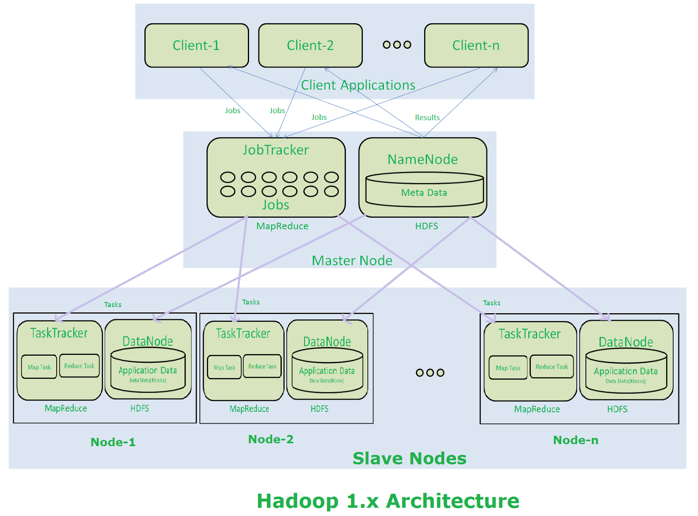

### What is Hadoop?

Hadoop is an open source framework by Apache Foundation for handling the storage, processing of large datasets. 
 
Hadoop 1 provides with two components, a distributed storage (HDFS) and distributed computation engine (Map Reduce). These components run their own daemons. 
 

### HDFS (Hadoop Distributed File System)

 
The Hadoop Distributed File System is designed to provide fault tolerant and scalable storage deployed on commodity hardware. By commodity hardware, we mean that it is based on low-cost hardware. It provides high throughput access to large datasets. It has a master-slave architecture, comprising of master and slave nodes. 
 

#### Name Nodes

The name node is a daemon whose single instance runs for a single cluster, on the master node. Its responsibility is to manage the meta data of all the files that are distributed across the cluster. The name node acts as a single point of failure here. 
 

#### Data Nodes

Several instances of data node run on the slave nodes. The data nodes store data in slots that are of size 64 MB by default. A single data block is replicated several times depending upon the replication factor. Data nodes send heart-beat (a signal) to name node to indicate it is running. 
 

### Map Reduce

Map Reduce is a programming model, that does distributed computing on a Hadoop cluster. It consists of two daemons: 
 

#### Job tracker

A single instance of job tracker runs on the same node as the name node. The client application submits the MapReduce Job to the Job Tracker first. One Map Reduce Job is broken into multiple mapper and reducer tasks. 
 

#### Task trackers

There are multiple instances of task trackers that running on data nodes. A task tracker executes the job assigned to it by the job tracker and sends the status of those jobs to the job tracker. 
 
 
Let’s have a look at the following figure to understand the work-flow of Hadoop architecture: 
 

 

- Clients interact with Hadoop through master nodes.
- They send their requests to the master node.
- Each job, as submitted by the clients, is received by the job tracker.
- The Job Tracker divides the job into multiple mapper and reducer tasks. It talks to name node to determine the location of data. It decides to run task manager on the same node or the nearest node to the one where the data is located.
- These tasks are passed to the task trackers, that are on the slave nodes.
- It is the role of task trackers to perform the tasks.
- Once all task trackers are finished with their tasks, job tracker takes up those results and produces the final result.
- This final result is sent to the client.

 
 
 
 
 
 
 
 
 
 
 
 
 
 
 
 
 
 
 

