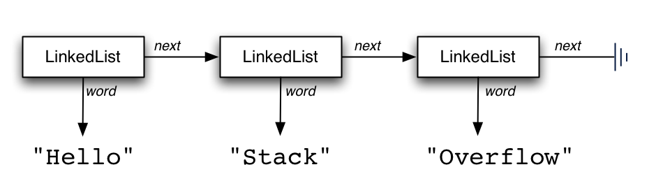
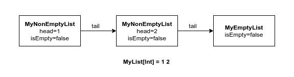

After studying the [why](https://amitashukla.in/blog/why-functional-programming.html) and [how](https://amitashukla.in/blog/tail-recursion-in-functional-programming.html) of Functional Programming, the time had come to study the real-life implementation of this paradigm. So, I went on reading Scala source code. And why not? Scala [claims](https://www.scala-lang.org/what-is-scala.html#functional) to be a full-blown functional language, and allows an easy migration from imperative to functional. It was plain sailing until I stumbled upon List.scala and saw this: 

```scala
def length: Int = {
  var these = self
  var len = 0  while (!these.isEmpty) {
    len += 1    these = these.tail
  }
  len
}
```
 
The above length method is used to find the number of elements in a list: 

```scala
 List(1,2).length
```

The length function _iterates_ over the list and increments a len counter until the end of list is reached. Now is there something wrong with this code? Well, nothing. It was just... unexpected. Why? Because it is not functional! See the vars and the while. The length function could have been implemented like this: 
 
```scala
def length : Int = {
  if(isEmpty) 0 else 1 + tail.length
}
```

It is not that I am against Imperative programming, but this was not something I came looking for. 
 


### With Expectations Come Disappointments. And then Hope.

In my previous [post](https://amitashukla.in/blog/why-functional-programming.html), I discussed why functional programming does not favour iteration, and how [Tail Recursion](https://amitashukla.in/blog/tail-recursion-in-functional-programming.html) is the way to overcome the need of iteration. Then why an imperative approach? Well, I researched heavily and got some leads that I will talk about [later](#why_imperative_approach). Now that I felt cheated, I took matters in my own hand. 
 


 
 
And so, I, Amita Shukla, decided to implement my very own, MyList! But hey, wait. Just because the list in not implemented the way I want it, I want to implement my own list? Actually, yes. But there are more reasons as well. 
 


- There are people who go about using data structures (like lists) without ever, ever implementing them. But the real thrill is in implementing one. And a linked list is the simplest one to start with.
- I have implemented linked list in [C](https://github.com/amita-shukla/programs/blob/master/TurboCFiles/CREATE_L.CPP) and [Java](https://github.com/amita-shukla/programs/blob/master/LinkedList.java) before, so it would be great to do the same in Scala. That would let me understand the philosophy behind each kind of implementation, and also, the syntactical differences between the languages.
- Reading Scala's List can be overwhelming. Scala's List is one of the most used classes in the language, and is power packed with functionality. It is abstract, covariant, has companion objects, implements classes/traits such as AbstractSeq, LinearSeq, Product, GenericTraversableTemplate, LinearSeqOptimised... It can be difficult to digest all in one go.
- Implementing List gives a better idea of the relative efficiency of list operations, which will help us to write fast and compact code using lists.

### The Road Map

Before coding anything, let's ponder over what exactly are we going to make. Here is how we will be making our way ahead: 
 


- [Determine the type of List to use (LinkedList v/s ArrayList)](#list_type)
- [Design the basic layout of MyList](#basic_list_layout)
- - [Covariance](#covariance)
 - [Singleton Object](#object)
 - [Case classes](#case_class)
- Add methods to MyList
- - [Take covariance further using add](#add)
 - [Pattern Matching with last](#last)
 - [Transform a list using map](#map)
 - [Understand foldLeft and Currying](#foldleft)
 - [Filter a list](#filter)
- [Some Afterthoughts](#footnotes)
- - [The equivalence of MyList to scala.List](#similarities)
 - [The differences](#differences)
 - [Why List is the way it is](#why_imperative_approach)

### Why is Scala List a 'LinkedList'?

Fundamentally, a linked list is a chain of nodes each referring to exactly one other node until you reach the end of the chain. Lists preserve order, can contain duplicates, can insert, remove elements in constant time (the first element, of course). 




 
Linked List enables to make Scala's list **immutable**. Why immutable? I discussed the need of immutability in my post [Going The Functional](https://amitashukla.in/blog/why-functional-programming.html)[Way](https://amitashukla.in/blog/why-functional-programming.html). In short, we can say that immutability lets you write a code that is free of side effects. 
 
A list has simulated operations as add or update or remove, these operations in each case return a new collection and leave the old collection unchanged. Hence, we can rely on the fact that accessing the same collection value repeatedly at different points in time will always yield a collection with the same elements. 
We can try something similar to java.util.ArrayList, but then it can not be immutable. 
 


### Back to the drawing board...

Our list should be able to hold a piece of data (let's call it `head`), point to the rest of the list (let's call it `tail`) and indicate if it is empty (a boolean variable `isEmpty`). So, all list operations can be defined in terms of these three operations: 
```scala
class MyList[A] {
  def head : A
  def tail : MyList[A]
  def isEmpty : Boolean
 }
```

`MyList[A]` defines a generic list. The term generic means we can define many specific types with one generically written class. For example, a list can be `MyList[String]`, `MyList[Int]` etc. If `MyList` is of type `A`, then the `head` is of type `A` and the `tail` is of type `MyList[A]`. 
 




 
However, this list doesn't suggest a way to indicate the end of the list. At first, it may occur to assign the `head` and the `tail` as `null`. But `null` has drawbacks associated with it (say, `NullPointerException` ). So, we need each node of the list to be either of the two types: 

- An object to mark the end of a list, let's say, `MyEmptyList`
- And a regular class to mark all the other nodes, let's say, `MyNonEmptyList`.

And therefore, our list should be abstract: so that we cannot instantiate `MyList` by calling an empty constructor. By making the list abstract, we can now instantiate a list only in terms of either `MyEmptyList` or `MyNonEmptyList`. 
 
```scala
abstract class MyList[+A] {
  def head : A
  def tail : MyList[A]
  def isEmpty : Boolean
 }

object MyEmptyList extends MyList[Nothing]{
  override def head: Nothing = throw new NoSuchElementException("Head of an Empty list!")
  override def tail: MyList[Nothing] = throw  new NoSuchElementException("Tail of an Empty list!" )
  override def isEmpty: Boolean = true
  override def toString : String = ""
}

case class MyNonEmptyList[A] (head: A, tail:MyList[A]) extends MyList[A]{
  override def isEmpty: Boolean = false
  override def toString : String = head + " " + tail.toString
}
```

We have a bunch of concepts here. 


### Covariance

`MyList` has a type parameter `A`. What does the `+` sign in front of it mean? In formal terms, A plus sign means that values of type A appear in **covariant** (+) position. In simpler terms, it means a list can also take the subtypes of A. A covariant position indicates that the type A always occurs as the output or return type. A `MyList[A]` is a subtype of a `MyList[B]`, if `A` is a sub-type of `B` (i.e. `A <: B`). 
 
```scala
// Testing the behaviour of (B:>A)
scala> abstract class Animal
defined class Animal
scala> class Dog extends Animal
defined class Dog
scala> class Cat extends Animal
defined class Cat
scala> val dogs = MyNonEmptyList(new Dog(), MyEmptyList)
dogs: MyNonEmptyList[Dog] = A$A0$A$A0$Dog@7666fc6c
scala> val animals = dogs.add(new Cat())
animals: MyList[Animal] = A$A0$A$A0$Cat@4f74ca8c A$A0$A$A0$Dog@7666fc6c
```

See? If we try to add a Cat to a list of Dogs, then the resulting list is a list of Animal. Covariance enables the compiler to find the suitable super type for all the type of objects inserted in a list. The implementation of the add method is discussed [later](#add). 
 
We have applied the same concept for declaring the `MyEmptyList` as `MyList[Nothing]`. `Nothing` is the bottom-most type in Scala, a type that is the sub-type of any other type. We can thus have object `MyEmptyList` extending `MyList[Nothing]`, and thereby `MyEmptyList` becoming the sub-type of `MyList[A]` for any possible `A`. Whenever we need a list, no matter what the element type, we can use `MyEmptyList`. 


### Object MyEmptyList

The `MyEmptyList` is not a class but a **Singleton object**.Unlike Java, there is no static keyword in Scala, instead, we have singleton object. We use an object here to define a single-use class for marking the end of the list. 
```scala
object MyEmptyList extends MyList[Nothing]{
  override def head: Nothing = throw new NoSuchElementException("Head of an Empty list! ")

  override def tail: MyList[Nothing] = throw  new NoSuchElementException("Tail of an Empty list!" )

  override def isEmpty: Boolean = true

  override def toString : String = ""
}
``` 
The value of `isEmpty` in the `MyEmptyList` is always true (well, obviously) and it is not supposed to have a `head` element or a `tail`. The `MyEmptyList` extends from `MyList` of type `Nothing`, which is the bottom most type of all types. This gives the best of both worlds: it is used to signal the lack of value and still be type-safe. As discussed before, that is the reason we have `MyList[+A]` instead of `MyList[A]`, because we accept objects of type `A` and it's subtypes (`Nothing`). 


### Case Class MyNonEmptyList

```scala
case class MyNonEmptyList[A] (head: A, tail: MyList[A]) extends MyList[A]{
  override def isEmpty: Boolean = false
  override def toString : String = head + " " + tail.toString
}
```

The MyNonEmptyList is a **case class**. What is a case class? With case class, you can define the primary constructor as part of the class declaration itself. So what is the constructor we are talking about here? Take a look: 

```scala
MyNonEmptyList[A] (head: A, tail: MyList[A])
```

This is cool as it allows us to force the user to parameterize the `MyNonEmptyList` with a `head` and a `tail` for instantiation. Obviously, a non-empty list must have a head and a tail. We use case class here because they let us magically perform Pattern Matching, as we will see [later](#last). 
 


### It's Time for Action!

Now that we have our structure defined, we can add some functionalities in our MyList class. 


#### Add an element to a list

The most basic function would be the ability to add an element to a list. It can be done as: 
 
```scala
abstract class MyList[+A] {
  [...]
  def add[B>:A](element: B) : MyList[B] = new MyNonEmptyList[B](element,this)
}
```
```scala
scala> val list = MyNonEmptyList(1,MyEmptyList)
list : MyNonEmptyList[Int] = 1
scala> val added = list.add(2)
added : MyList[Int] = 2 1
scala> val anyList = c.add("Amita")
anyList : l: MyList[Any] = Amita 2 1 
```  

As explained in the covariance section, adding an element of a different type allows the compiler to return the list of the nearest common super type. Also, observe that the add function adds an element to the front of the list and not to the end, as adding to front takes O(1) time whereas adding to last takes O(n) time for linked lists. 


#### Finding the last element of a list

Now let us start with some pattern matching magic! Suppose we have to write a function to return the last element of a list:

```scala
def last : A = this match {
  case MyEmptyList => throw new Error("Last of an empty list")
  case MyNonEmptyList(head,MyEmptyList) => head
  case MyNonEmptyList(head,tail) => tail.last
}
```
```scala
scala> val list = MyNonEmptyList(1,MyEmptyList).add(2).add(3)
list : MyList[Int] = 3 2 1 
scala> val last = list.last
last : Int = 1
``` 


What is pattern matching here? Pattern matching is a mechanism for checking a value against a pattern. It is a more powerful version of the switch statement in Java. Its best use is Case Classes, as you see in the above implementation. The head and tail of a MyNonEmptyList can be used in the case body. 
 
Though Pattern Matching can be used to deconstruct complex structures and can be used in place of if-else statements, the compiler generates a lot of code under the hood if pattern matching is used for booleans. 
 


#### Mapping a List

The map applies the function passed to it to convert each element of the list into a different value or type. It is really simple to implement:

```scala
def map[B>:A](f : A => B) : MyList[B] =
    if (isEmpty) this
    else tail.map(f).add(f(head))
```
```scala
scala> val list = MyNonEmptyList(1,MyEmptyList) add 2 add 3
list: MyList[Int] = 3 2 1
scala> val mapped = list.map(x => x+1)
mapped: MyList[Int] = 4 3 2
```
 


A map is a useful function as it can be used for list transformations. Let's have a look at another such important function: `foldLeft`. 


#### FoldLeft

The signature of the foldLeft function is as follows: 
foldLeft\[B](z:B)(f: (B,A)=>B):B 
The foldLeft function goes through the whole List, from head to tail, and passes each value to f. For the first list item, that first parameter, z, is used as the first parameter to f. For the second list item, the result of the first call to f is used as the B type parameter. 
 
```scala
def foldLeft[B](z : B)(f : (B,A)=> B) : B = {
  if (isEmpty){
    start
  } else{
    val current = f(z,this.head)
    this.tail.foldLeft(current)(f)
  }
}
``` 
```scala
scala> val list = MyNonEmptyList(1,MyEmptyList) add 2 add 3
list: MyList[Int] = 3 2 1 
scala> val folded = list.foldLeft(0)(_+_)
folded: Int = 6
```


The `foldleft`has a 'left' in it as it operates by taking elements of a list from left to right. Why is this important? Because there can be functions which output different result depending on whether the order of operands (e.g. divide operation, log function etc).

The foldLeft method is a **curried** function. In simple terms, it just means that it accepts two arguments in separate parentheses instead of one. 


#### Filter

A filter is a function that drops those elements of the list which do not satisfy a given condition.

```scala
def filter[B>:A](f:A=>Boolean) : MyList[B] = {
  if(isEmpty) this
  else {
    if (f(head)) MyNonEmptyList(head, tail.filter(f))
    else tail.filter(f)
  }
}
```
```scala
scala> val list = MyNonEmptyList(1,MyEmptyList) add 2 add 3
list: MyList[Int] = 3 2 1 
scala> val filtered = list.filter(x=>x%2!=0)
filtered: MyList[Int] = 3 1
``` 


 


So far, we have implemented the functions add, last, map, foldLeft, filter. There are many more functions in the original Scala List that we can implement in a functional way. However, there are some points that we should keep in mind. 


### Foot Notes

- Remember that all the operations are on immutable lists, i.e. they return a new list every time they are called and do not modify the original list.
- The scala.List has a similar structure with a few differences. The `MyEmptyList` discussed here is similar to the object `Nil`, and `MyNonEmptyList` is equivalent to the class `::` (pronounced as 'cons'). In Scala, the special properties of any method-name ending with `:` is that it makes the operation right-associative. Therefore, `MyNonEmptyList(head,tail)` can be written as `tail.::head` or `head :: tail` .
- Not all functions in `MyList` are as efficient as they can be. As I discussed in my post about [Tail Recursion](https://amitashukla.in/blog/tail-recursion-in-functional-programming.html), functions can be made tail recursive for efficiency. Let's take the simplest example, `length`:
```scala
scala> val list = MyNonEmptyList(1,MyEmptyList) add 2 add 3
list: MyList[Int] = 3 2 1 
scala> val filtered = list.filter(x=>x%2!=0)
filtered: MyList[Int] = 3 1
```
```scala
scala> val list = MyNonEmptyList(1,MyEmptyList) add 2 add 3
list: MyList[Int] = 3 2 1 
scala> val length = list.length_tailRecur
length: Int = 3
```

- Why imperative approach for scala.List? [This](http://www.artima.com/pins1ed/implementing-lists.html#22.4) discussion, by Martin Odersky, Lex Spoon, and Bill Venners talks about why imperative implementation was used for immutable list implementation. Also worth reading is [this](http://debasishg.blogspot.in/2008/10/to-tail-recurse-or-not.html) article by Debasish Ghosh, where he talks about localized mutation to achieve performance, instead of a functional implementation of map function in Scala.

There can be lot more refinements possible, but taking the first step is a feat in itself. The complete code is available on Github [here](https://github.com/amita-shukla/functional-programming/blob/master/FunctionalList/src/com/amitashukla/test.sc). We have worked on a lot of elements, which are important constructs when doing functional programming and working with Scala in general. A lot can be taken further though. Stay tuned!


