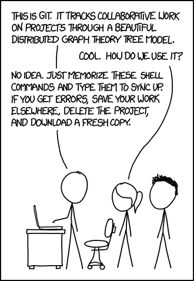
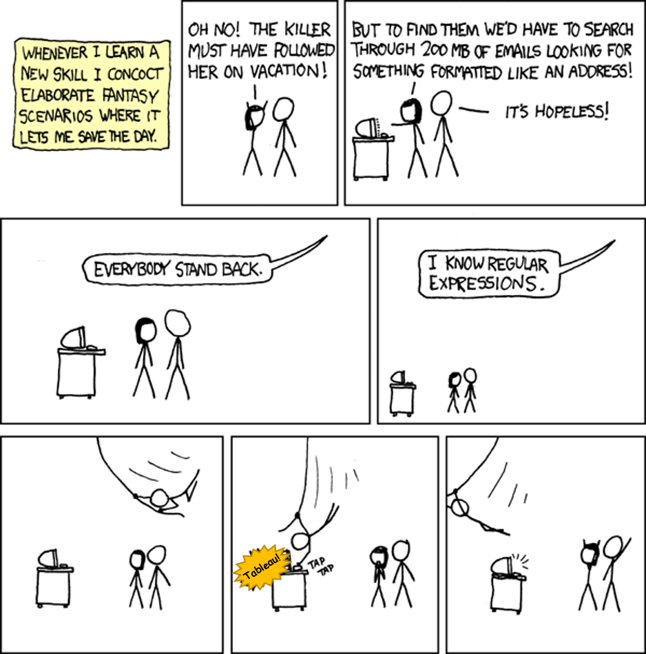
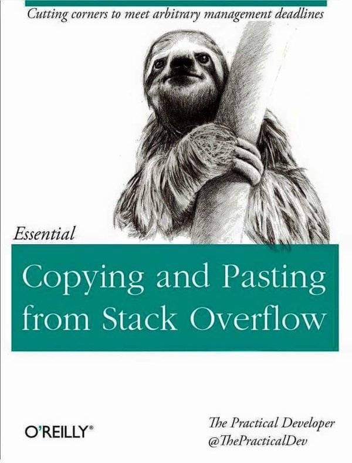

It is said that \"Master the work you do most often\". So if programming is what we do most often, we should definitely come up with practices that help us to master whatever we do, along with learning new skills. 
 
Here are a few habits that I follow to make myself more and more efficient as a programmer, gain knowledge and garner appreciation from others! 
 

 
 

### 1. Use Git

Git is an excellent tool for code collaboration. Let's start with the popular advantages. It offers: 

- distributed development,
- feature branching/merging capabilities,
- flexible workflow

But you can put Git to you immediate uses well! 

#### Git acts as a central repository for all your code.

So, you can have a look at your code wherever and whenever you want, as it is always online. I upload most of my personal code at [Github](https://github.com/amita-shukla) so that it is easily accessible to me and as well as to the public.

 

#### Git is useful to keep track of code changes.

Git gives you the power to \"rewrite history\", so you can see what the changes you made and discard the changes that you no longer want. The git commit history itself acts as a development log.

 

#### Showcase your code to the world

When you write awesome code, what is the point in keeping it hidden? Show Off. There is no better demonstration of a programmer's work than his code. 
 
 

 

 

Beware! Git is a steep learning curve if you have never tried it before. [Here](https://amitashukla.in/blog/how-to-set-up-git-repository.html) is one article to get you started.

 

### 2. Learn Regex

Quite often you must have stumbled upon pattern matching. And be it any programming language you use, regex is a tremendously handy tool to do so. It has the power to search through huge texts of code in the most concise way. 
 

 
Here is the basic regular expression notation: 
`\[ ]` matches a single character contained within the brackets. 
`\[^ ]` matches a single character that is not contained within the brackets. 
`^` matches the first character of the string 
`$` matches the last character of the string 
`\*` matches characters preceding it one or more times 
 
There are several cheat sheets available on the internet, it is useful to keep one bookmarked. [Here](https://www.cheatography.com/davechild/cheat-sheets/regular-expressions/) is what I keep with me. 
 

### 3. Create aliases for the commands you use most frequently.

Someone told me if you have used a command for more than 21 times, create an alias for it.

- It reduces the amount of typing necessary from long commands. Suppose you need to edit one file regularly, by opening it in an editor. You can create an alias such as:

`alias a=\"gedit /etc/httpd/conf/httpd.conf\"` 
Then just type this single letter command and escape from the tedious task. 

- Aliases can be used as a shorthand for some other version of a command that you use more frequently.

`alias ls=\"ls -lrt\"`, or,

`alias hls=\"hadoop fs -ls\"` and so on.

 

 

The problem with aliases is that they are valid only for the current login session. To deal with this, an alias for any user can be added to the_.bashrc_file in that user's[home directory](http://www.linfo.org/home_directory.html). Because this file is read at login, the change will not take effect until the user has logged in again. 
 

### 4. Keep a text editor

When we are involved in work, we need some place to keep temporary data, steps of execution or any other random data that we don't want to save but neither to just vanish away when shutting the computer down. And thus having a text editor handy is a plus, be it Notepad++ (it has two plus for a reason), or Sublime Text. Let's discuss some notepad++ features: 
 

- Multi-tabbed feature that you can create several files at once (double click an empty space beside your current file and you get a new file)
- Support for several languages
- Syntax highlighting according to the language being used.
- Auto completion
- Document map etc.

 
Keep all the clutter out of your mind and on a notepad. Want to remember a set of commands? Note them down. Want to remember some file paths? Note them down. Want to remember execution steps? Note them down. At any later point of time, save these notes and get a raw documentation! 
 
For Linux distributions, make Sublime Text your friend.

 

Bonus tip: Enter`data:text/html, <html contenteditable>` on your google chrome new tab and convert it into a minimalistic notepad. 
 

### 5. Be Active On StackOverflow

 
Firing a query on Google, and getting the answer from [StackOverflow](http://stackoverflow.com/) saves our day (and our career). What we forget is that it is a community run by people like us. And by saying 'being active' I do not mean just anonymously searching the answers to your questions, but creating an account there and actually 'being there' in as many ways possible. But why should you take the burden? 
 

#### It's a give-n-take relationship.

You get help from other people, and in return, you help other programmers out there. It doesn't take much time, but you will save the time and effort of some other programmer sitting in some other part of the world struggling with the same problem.

 

#### Earn Reputation.

 

Your contribution to the community doesn't go in vain. You earn reputation from other programmers who validate your answers and thank you in the form of upvotes termed as 'reputation'. Not only by answering, but even asking the right questions can fetch you reputation. Show it off and earn a high reputation in the real world!

 

#### Track yourselves.

OK. This is important. If you do not believe in being 'social', then here is how Stack Overflow can help you. Just be logged in Stack Overflow and you can do a lot more with it. You can mark the questions that you liked as your favourites, or just upvote the answers which helped you. Stack Overflow keeps the record of your activity. Trapped in a situation when you know that the hack to your problem is present in Stack Overflow but can't actually recall it? Just track your activity and dig that question/answer out.

 

#### Earn Karma.

### 6. Keep Linux Commands Handy

The terminal can be our friend if we know to use its potential to the fullest. Use these to hacks your Linux: 
 

 

#### Tab Completion

No, no. You don't need to type everything. Just type a letter, and press tab. The tab completion feature completes file names, commands, everything for you.

 

#### Pipes

Send the output of one command to another as input using pipes ( | ). 
One of the most useful example: 
`$ ps aux | grep conky | grep -v grep | awk '{print $2}' | xargs kill`

 

#### Wild Cards

The \* character – that is, the asterisk – is a wild card that can match anything. 
For Example, 
`rm a*.txt` 
This removes all files starting with 'a' that are of .txt format.

 

#### Output Redirection

' `>` ' redirects the command output to a file instead of the terminal. This can come handy if you want to save logs of a command in a file.

 

#### Launch a command in background using '&'

`firefox &` 
This is useful when you want to launch a command but continue using the terminal.

 

#### Conditional Execution

You can have 2 commands run one after the other. Writing a && between the two commands will only execute the 2nd command after the first one successfully executes. For example, 
`cd /home/user/Documents && ls` 

#### Search and Use the commands from the past

Don't type a command again and again. Press `ctrl+r` and type any key words that you can recall. Shell looks up in the history and finds it for you. Voila!

 

There are so many other tricks out there that an entire post (perhaps a book) can be dedicated to it. Also, a lot more can be done by scripting your long list of commands. I mentioned a few of them in my post [Shell In a Nutshell](https://amitashukla.in/blog/shell-in-nutshell.html). 
 

### 7. Learn to make Diagrams and Presentations

If you end up addressing a large crowd, you will have to make presentations and lots of diagrams. This skill may be secondary, but what good that knowledge is that can't be expressed? Your Office software can be good enough for this, only if you learn to leverage it properly. 
 

### 8. Read Code. A lot of Code.

Thanks to the open source community, you can read the code that you use.

- Knowing the internal design of your code helps you realize if you are using it right.
- Life is short that you can write all the good code out there yourselves. Reading others' code transfers their knowledge to you. But for that, you not only need to 'read', but also understand why something was written that way.
- When you know what your code is doing to its depth, you know its strengths and limitations, and brag about it all, and get the appreciation for the knowledge resource you are! You can thank me later :P

 

### 9. Make Your Keyboard Your Friend

Make sure your fingers know which key to hit in order to type what are you thinking. If you are still looking down while typing, you are not trusting your keyboard enough. If you have been using the same keyboard for quite some time, look up the screen and type. Just the same way you don't need to figure out how to write when you take notes, you should not think on how to type while coding. It may be obstructive at first, but you won't realize when you start typing at the speed you are thinking.

 

Also, by looking down while typing, you are harming your neck, spine, eyes. Sit straight and type for hours. 
 

### 10. Document What You Learnt

There is one documentation that we all hate writing. But then there can be one another kind of documentation. Your personal one. Make a habit of documenting what all you learned today. How many times it has happened to you that you see a problem and realize that you have done it before but can't recall it now? You have no option than to do it all over again. Sad.

 

Maintaining a personal documentation, or call it a journal, helps you recall quickly the solution to a problem you have already encountered before. Not only this, a day when you feel downright stupid, you can look back at your doc to see the long list of things you have learnt and feel all up! 
 

### 11. Blog

Now that you are maintaining the Journal, if something important pops up. You can go ahead and tell others about it! It also makes you a better presenter. If you can blog about it, you have gained the power to explain it. 
 

### 12. Read Books.

I can't emphasize this point enough. There are excellent pieces of literature whose knowledge out there that are waiting to be digested by you. 
 
 

 

Too busy to read? I have a trick that worked for me. Whenever you feel like picking up your phone and browse your feed, pick that book instead. And then you will realize how much time you actually have.

 

For start, you can take inspiration from my reading list:

- Code Complete
- Clean Code
- Head First Design Patterns
- Hadoop The Definitive Guide
- Effective Java
- Hadoop in Action
- Learning Scala
- Hadoop Real World Solutions CookBook

For a more comprehensive list, you can read [this](https://stackoverflow.com/questions/1711/what-is-the-single-most-influential-book-every-programmer-should-read) thread.

 

That's all for now. Eat right, exercise, and don't drink too much coffee. Try to be the best and you will surely get better and better. Have some excellent tips that you follow? The comments section is all yours! 
 