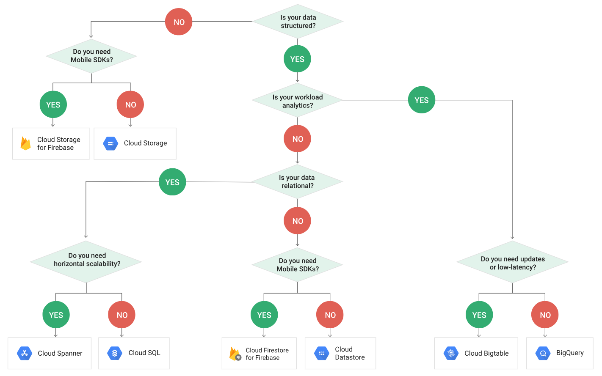

Google Cloud Platform (GCP) is fairly new in the cloud market, dominated by the AWS. Though Google has a long way to go in terms of the variety of tools offered in the cloud space, the good part is that its current set is enterprise ready. I had my share of the Google Cloud experience at work, and then while preparing for the Google Could Data Engineer exam. Studying and playing with these tools was so fun and securing the certificate (and a google hoodie) was a sweet award for it. 
 

### Google Cloud Certified Professional Data Engineer

_A Professional Data Engineer enables data-driven decision making by collecting, transforming, and visualizing data. The Data Engineer designs, builds, maintains, and troubleshoots data processing systems with a particular emphasis on the security, reliability, fault-tolerance, scalability, fidelity, and efficiency of such systems._ 
 
_ A Data Engineer Certification proves that you are able to leverage the cloud platform for development, from using cloud storage, processing batch and real-time data, publish/subscribe messages, build machine learning models, save results to data warehouse, to visualize this data on cloud. The certification calls for not mere knowledge but prior hands-on with the GCP suite._
 

### Google Resources

There are plenty of resources, provided by Google to prepare for the Data Engineer Certification. Here's the list: 

- [Certification Exam Guide](https://cloud.google.com/certification/guides/data-engineer/)
- [Coursera GCP Data Engineer Series](https://www.coursera.org/specializations/gcp-data-machine-learning)
- [Google Training](https://cloud.google.com/training/data-ml)
- [QuickLabs GCP Essentials](https://google.qwiklabs.com/quests/23?locale=en)
- [QuickLabs Data Engineer Quest](https://google.qwiklabs.com/quests/25?locale=en)
- [Practice Exam](https://cloud.google.com/certification/practice-exam/data-engineer)

### My take on GCP Data Engineer Certification

As previously said, the GCP Data Engineer exam requires not only theory, but hands-on experience on these tools. I did have some experience with some of them, but definitely not all of them!

What helped me with this was the Coursera GCP Data Engineer Series. The course is anyway to go for even if you are not aspiring for the certification. The course extensively teaches you not only the fundamentals, but how to store it, query it, retrieve it, and what to do with it.

The course is lengthy and thorough (it took me 1 month to finish it). Also, it is not enough for the certification.

 

The exam is quite scenario based. Thinking that the Case Studies mentioned in the guide only ones coming your way? Nope. There are many more scenario based questions, that are asked, testing your knowledge on the myriad of tools available.

 
Most of them were based on which were tool was appropriate at what situation. Here is a link that helped me prepare for the same: <https://cloud.google.com/storage-options/> 

 

 

- Questions based on both the case studies mentioned in the exam guide appeared. Please read the case studies before hand to save time and directly jump to the questions.

- There were no direct questions. A rare, but simple question:

 _\"... have to store transcational data that has to be global... which would be the most appropriate tool...\" options:Bigquery, cloud SQL, datastore, bigtable_

- Abundant questions on stack driver:

 _\"... multiple people are doing big query jobs, you need to be get logs only for a particular table...\" options: use Stack Driver monitoring and filter, pass stack driver audit logs to pub sub and write a filtering logic in cloud dataflow, push logs into pub sub and access using your own monitoring tool\"._

 __

 Almost every question had a option proposing a solution using stack driver

- There were some questions not related to GCP at all.

 _\"... what would you use to do ETL on large data\" select 3 options: redis, cassandra, hadoop, MySql, Hbase_

 _You have map reduce jobs to do ETL. Now the data is going to increase tremendously.\" options: rewrite the jobs to pig, rewrite in spark, rewrite in hive\"_

- Machine learning algorithms and their use case were abundant.

- _\"You are given only a single machine to predict the housing prices... which algorithm to use?\" options: gradient descent, feed forward neural network, recurrent neural network, logistic regression\"_

- _\"a data scientist wants to build a machine learning model and visualize the data on your vm instance. but her laptop is not powerful enough. you want to help her. what will you do?\" options: set jupiter on her laptop, set up visualization on VM instance, give her cloud datalab access, use cloud ml \"_

- _\"your model given little error on training set but high error on test set. what will you do?\" (one of the option was dimentionality reduction)_

- _\"you are given a bank transaction data: name, transaction location, transaction amount\" which machine learning algorithm can you run on this data\" options(select 2): unsupervised learning to predict fraudalent transactions, supervised learning to predict fraudalent transactions, unsupervised leanrning to predict transaction location, supervised learning to predict transaction location\"_

- There were many more questions on supervised, unsupervised learning, fraudalent transaction prediction

- dataflow and pubsub were mostly combined 
 _\"need to to do streaming analysis user activity data ... which window to use..\" options: global window, fixed window, sliding window, session window\"_

- bigquery access questions: 
 _\"you have data used by several clients. how will you make sure that clients cannot see each others' data\" options: create service accounts, create IAM roles for each user and share datasets, use stack driver to notify users accessing unassigned dataset, restrict bigquery api access\"_

- _\"you uploaded a csv file into bigquery but the data loaded is inconsistent what has gone wrong?\" options: you forgot to select csv as file type, csv file had some bad records which were skipped..._

- _\"you had a table, you exposed a view on it by writing a sql query in legacy sql. now other people want to do analysis using API\". options: a) let users query as it is. b) create another view on top of the view using standard sql, c) create another view from table using standard sql, d) write a dataflow program that takes the data and puts data into another table\"_ Answer: c As per the recommendation, if the user has to use standard-sql , then c is the best option.

- Refer https&#x3A;//cloud.google.com/bigquery/docs/views-intro#view_limitations

- some questions on debugging, like 
 _\"you are using streaming data from pubsub+dataflow and visualizing it. but some messages are missing. what can go wrong?\"_

- 2/3 direct questions on how to construct row key in big table. This concept is explained thoroughly in coursera google data engineer course.

 

I took the test almost an year before, and i hadn't published these questions before as these questions were not 'defined'. These questions were part of my scribbling, straight out of the working memory. The exam questions format is strictly multiple choice questions, and the pattern can be recognized by taking the GCP Data Engineer practice exam as well (I did not take this myself, as it was not available at that time). I still keep getting a lot of queries, so I thought it worthwhile to publish these. Hope it helps! 
 

 

 

