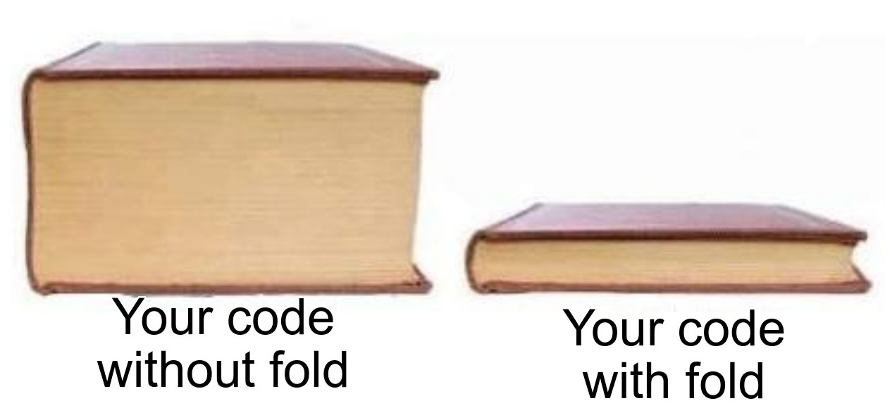

 
Lists can be represented as: 
 
`data [a] = [] | a : [a]` 
 
Consider the following functions: 

```haskell
 foldl :: (b -> a -> b) -> b -> [a] -> b
 foldr :: (a -> b -> b) -> b -> [a] -> b
```
 
These two functions are used for what we call _folding_ over a list. What does it mean by folding? In a broad sense, we can say that folds give us the power to evaluate a list by applying an operator between the list elements. First examples that come to mind can be finding the sum on a list of integers, append the elements of a list, etc. To fold, we also need a default value when we come to evaluate the end of list, or over an empty list, hence a seed value. Take a closer look at the type signatures, we can say that folds are much more powerful than these examples, as they also give us the power to change not only the structure of the list, but also the type of list. 
 
Both foldl and foldr take a seed value of type `b`, a list of type `a`, and a function (let's call it `f`). We can notice that `foldl` and `foldr` are only different with regards to `f`. 
`foldl` takes the seed value `b` and applies it to the head of the list, 
`foldr` takes the seed value `b` and applies `f` to the end of the list. Let's see how. 
 


### Fold behaviour using examples

Suppose we have a list, and we need to sum over this list. Finding the sum means running over the whole list and adding the elements using `(+)` operator. 

```haskell
 let x = 1 : 2 : 3 : Nil
 foldl (+) 0 x = ((((0 + 1) + 2 ) + 3 ) + Nil)
 foldr (+) 0 x = (1 + (2 + (3 + (Nil + 0))))
```
 
While it all looks ok, what stands out is applying `(+)` on Nil. How is that supposed to behave? Let's assume for now that `(+)` of an operand with `Nil` equals to that operand: 

```haskell
 x = 1 : 2 : 3 : Nil
 foldl (+) 0 x = ((((0 + 1) + 2 ) + 3 ) + Nil) = (((1 + 2) + 3 ) + Nil) = ((3 + 3) + Nil) = (6 + Nil) = 6
 foldr (+) 0 x = (1 + (2 + (3 + (Nil + 0)))) = (1 + (2 + (3 + 0))) = (1 + (2 + 3)) = (1 + 5) = 6
```
 
A few more examples: 
`product = foldr (*) 1` or `product = foldl (*) 1` 
`length = foldr (const (+1)) 0` or `length = foldl (const (1+)) 0` 
Both `foldl` and `foldr` produce the same answers. 
 
Let's implement both these functions to gain some more insights into their behaviour: 

```haskell
 foldl :: (b -> a -> b) -> b -> [a] -> b
 foldl f z Nil = z
 foldl f z (h : t) = foldl f (f z h) t
```
 

```haskell
 foldr :: (a -> b -> b) -> b -> [a] -> b
 foldr f z Nil = z
 foldr f z (h : t) = f h (foldr f z t)
```
 
Jotting down the key features here: 
foldl is 
- lazy (Haskell is lazy by default), 
- tail recursive (the function `f` is applied first, and the recursive call is made later, in `foldl f (f z h) t`), 
- left associative (consider the example above: `(((0 + 1) + 2 ) + 3 )` ) 
foldr is 
- lazy (nothing is evaluated until result is needed), 
- not tail recursive (recursive call to `foldr` is made first, and then `f` is applied on top of it, in `f h (foldr f z t)`) 
- right associative (consider the example above: `(1 + (2 + (3 + 0)))` ) 
 


### Too lazy to fold infinitely

Now I am going to apply folds on an infinite list and see what happens. Wait what? Obviously, if we call any fold on infinity it's bound to overflow, right? But hey! we just forgot, that these folds are **lazy**. This means, that folds will only evaluate the list unless the result is actually needed. So if we have a function such as `find`: 

```haskell
 findl :: (a -> Bool) -> [a] -> Bool
 findl p = foldr (\a b -> if p b then True else a) False
```
 

```haskell
 findr :: (a -> Bool) -> [a] -> Bool
 findr p = foldr (\a b -> if p a then True else b) False
```
 
Observe that the arguments are reversed for `findl` and `findr`. Now let's try to run these: 

```shell
 >> findr even [1..]
 >> True
 >> findl even [1..]
 ^CInterrupted
```
 
Observe that while `find` using `foldr` gives an answer, but `foldl` doesn't. But should that's how it should be with infinite list? What kind of magic is this `foldr` doing?? Well, it's no magic but laziness. The `foldr` is simply not doing much. Let's have a look at `foldl` and `foldr` implementations again: 

```haskell
 foldl f z (h : t) = foldl f (f z h) t
 foldr f z (h : t) = f h (foldr f z t)
```
 
While `foldl` first makes the recursive call, `foldr` first applies the function `f` and then recursively calls itself. But in our case of `find`, the `f` here is a boolean function. So if `f h = True`, then it need not go into evaluating the entire list! But such is not the case with the poor `foldl`. Before even applying `f`, `foldl` needs to recursively call itself (in a way keep looping...). Therefore, `foldl` cannot use `f` until it has worked out its entire nested expression. And hence, `foldr` is always the recommended way of folding. The thing to remember here is that **laziness works for infinite lists when the second argument to the combining function is lazy**. That's why `findr` is possible but not `(+)`. If we remove laziness from the picture, then both the arguments to the function need to be evaluated immediately, and then it won't matter if we are calling `foldl` or `foldr`. Actually it would matter a bit, as `foldl` is tail recursive, and thus would be more efficient. 
 
Did not care to read the big para before? let's point what we learnt: 
- both `foldl` and `foldr` use a combining function having 2 arguments. 
- if the combining function is lazy in its second argument, `foldr` evaluates for infinite lists, whereas `foldl` doesn't. 
- This is because `foldl` is implemented in such a way that it has to first construct the entire expression before evaluation, hence stack overflows. 
- If `foldl` is made strict (there is a `foldl'`), then as tail recursive is more efficient, it can be used to improve the performance of the code. 
- Hence, `foldr` is the recommended way of folding, in order to preserve lazyness across function composition. 
- However for strict languages, `foldl` seems a more natural choice. 
 


### What all can be folded

Till now we are seeing list being folded into a single value, but folds are not restricted to end into a single value. They can be anything as long as the type signatures match! 
There is something special about `foldr` if we take a different perspective. Till now we consider `foldr` as 'folding from the right', which, well, is like that. Let's look again at our foldr example: 

```haskell
 for the list 1 : 2 : 3 : Nil
 foldr f z x = 1 `f` 2 `f` 3 `f` z
```
The similarity is quite striking! for every foldr operation, the cons `(:)` operator is replaced by infix `f` and `Nil` is replaced by `z`. This is what we call **constructor replacement**. Therefore, we can use `foldr` for actually replacing the list constructor. 


 


#### map

Let's try mapping over a list using fold: 

```haskell
 map f = foldr _f _z
``` 

Let's now fill in `_f :: (a -> b -> b)`. For mapping over a list, we do not need to change the structure of the list. Hence, we need `(:)`. But just `(:)` is not sufficient. So at any point of time, if we are dealing with an element `a`, then we need it to be first transformed into `b` and then appended to the rest of the list as before. Voila! `_f = ((:) . f)`. Here, `(.)` operator is called **compose**, where `f . g` is equivalent to `\x -> f (g x)`. 
Next we need a default value for mapping a list in place of `_z`. What can be the default value for a list? Well, it's `Nil`. Hence: 

```haskell
 map = foldr ((:) . f) Nil
```
 


#### filter

Similarly, let's think about applying `filter :: (a -> Bool) -> [a] -> [a]` 

```haskell
 filter p = foldr _f _z
 ```

Here, yet again, a list remains a list hence `_z = Nil`. Now think about `_f`. For filtering a list, at any point of time, if we have an element `a`, for it to go in the list we need to check if it satisfies the predicate `p` and then if it does we add it else we don't. So `_f = \a b -> if p a then (a : b) else b`. Hence: 

```haskell
 filter = foldr (\a b -> if p a then (a : b) else b) Nil
```
 


#### append

Let's make it more challenging. What about appending two lists? i.e. implementing `(++) :: [a] -> [a] -> [a]` 

```haskell
 (++) xs ys = foldr _f _z
```
so what should be the ending/default value `_z`? For appending two lists together, we need that in `Nil` of first list, we get the second list. Hence `_z = ys`: 

```haskell
 (++) xs ys = foldr (:) ys xs
```
To write this in point-free notation, flip the args: `(++) = flip (foldr (:))` 


 
I have dedicated a whole post to fold coz folds are not only widely used, for me they were the first steps into functional programming. Knowing the power of folds eabled me to write implementations of a lot of more functions in a crisp manner (Before that I was pattern matching for everything). I am a merrier fp programmer now that I have folded!

