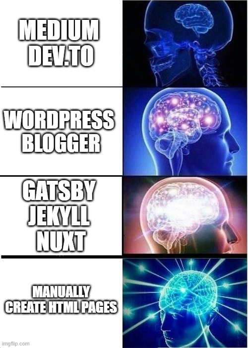

Enough is enough, I have thrown away my older site and have switched to Static Site Generator- GatsbyJS based blog and portfolio. It wasn't so easy as I built this in about 2 months while the older one was running since eternity.

I started this blog around 5 years ago, and at that time all I wanted was a place to write and publish. I wanted the easiest way possible, and a quick search on "how to blog" yielded Blogger. I explored around a bit, and set it up with a free domain, a basic theme and a writing interface.

And since then I have kept on adding new stuff to it. I named the blog Scribble, coz scribbling my notes was what I was doing on this blog. I found a custom free theme online that I liked and tweaked the look and feel. When I started working I realized how common it was for people to buy domains, so almost a year later I purchased a domain [amitashukla.in](https://amitashukla.in). 3 years down the line, I discovered Github Pages and created a Portfolio website on top of it. But now I had to maintain 2 domains, one apex running the portfolio site and another subdomain [blog.amitashukla.in](https://blog.amitashukla.in) running the blog. So I then tweaked the portfolio site's CSS to look exactly like the Blogger site! 

Over time the entire site started feeling like maintaining a legacy software.

## Problems with Blogger
Blogger is a specialized blogging tool for a layman, but being a programmer it always felt limiting to use.
<ul>
<li>It has its own <b>platform-specific syntax</b> to code its theme. This had a lot of disadvantages, particularly:
  <ul>
  <li>The theme code was almost opaque. Though it was possible to locate the code for a particular widget, it was always tightly bound to the syntax. The free theme I downloaded had some code like below where variables were defined in Unicodes that you just couldn't touch. 
  </li>
  <li>Customizing any widget code was difficult as you needed to understand the special syntax and escape HTML characters inside. The XML blog seemed to scream on your face that it wanted to be left alone!</li></ul>
</li>
<li>Blogger has a range of free widgets. After WordPress, perhaps Blogger is the one that has the highest number of widgets. These <b>widgets were more or less black-boxed</b>, and that was all. Anything new I wanted to add meant I again needed to code in that blogger-specific-madness.</li>
<li><b>Edit HTML</b>. Blogger has this okayish editor that you can write on, but anything the least creative needed to be coded in HTML, and I ended up doing that almost every time. Apart from focussing on content, I was also constantly taking care of breaklines and headers and code snippets.</li>
<li> Blogger is a Content Management System (CMS). CMSs run on a server and the <b>content is saved in a DB</b>. Whenever we land on a page, these servers construct the entire page, populate data from a database and serve it on the browser. A CMS has just too many moving parts that are simply out of your control.</li>
<li> probably the most significant of all, your <b>blogger posts are owned by Google</b>. 5-6 years before I wasn't really concerned about Big Companies owning all the data in the world, but these days the scenario is different. The last thing I wanted was to publish something that Google gets offended with and blocks by years of hard work.</li></ul>

## Options
Well, there are a number of options out there apart from my current arrangements that I thought to move onto.

### WordPress 
WordPress is on the same wagon as Blogger, it is also a CMS. But WordPress is much more powerful:
  - It has all the plugins you can think about. 
  - Provides a self-hosted solution.
  - It also has innumerable resources on every requirement possible. 

This was actually the option I thought about moving to first, but it has its own set of limitations.
  - WordPress needs more resources to be hosted. I would need to not only buy space on cloud to host my files, but also the processing power to run it continuously.
  - This means I would need to worry about managing the platform,
  - After Blogger, I didn't want to be tied to another similar platform. While WordPress provides you with its own nice editor, I will be in the same position years down the line as I am today with Blogger.

### Medium
While Medium looks like an excellent platform, but it again poses the problem of owning your content.
  - It looks like I own my content, but would I ever read its terms of service before posting?
  - I can own my content, but I have no control over the reading experience Medium provides. I have heard people bickering about the pop-ups, and Medium is just a company whose main focus is to maximise the audience.
It doesn't mean that I am totally anti-medium or similar platforms, a larger audience doesn't hurt. Maybe I post some of my content there!

## The curious case of Static Site Generators
5 years before when I hadn't even heard about Static Site Generators, I did realize that it was wise to keep my blog posts backed up at a place other than Blogger, and so I created a repository [blog](https://github.com/amita-shukla/blog) on Github where I would manually download all the HTML of each post and save them in markdown format. This obviously didn't work for long.

My Github portfolio served the about, contact, project pages of my site. These pages were simple HTML pages. I couldn't even think about adding more functionalities to them, because these were not maintainable. e.g. For a common component such as `NavBar`, had to be coded on all the pages. Then for any change, I needed to go and make the same change at three more places.

This is where Static Site Generators come into play, they 'generate' these HTML, CSS and Javascript files. So under the hood:
* I create a normal application 
* Build the app locally
* The app generates simple HTML, CSS and Javascript files.
* These static files can be hosted for cheap (almost free) as these are just like any other files.

To add content:
* Create a markdown file
* the static site generator on build picks up these files and creates a separate page on the site for them automatically.

## Why Gatsby?
There are a number of Static Site Generators out there, and I wanted to work on an ecosystem that gives me a lot of exposure to a number of libraries. I, therefore, narrowed down on Javascript based SSGs. I further had experience in React, so Gatsby was one of the top choices.
* [Gatsby](https://www.gatsbyjs.com/) is built on react, I can go on to do all that I can do with React. 
* Gatsby provides an interface on top of React so I don't need to worry about low-level plumbing (such as routing) again.
* Optimized for Image hosting: Even though I don't have many images on my blog, I have struggled with images a lot as they seriously affect site performance. Gatsby has advanced mechanisms for keeping images responsive and creating placeholders for a smooth transition while an image loads.
* **GraphQL!** Gatsby uses GraphQL to fetch all kinds of data, which I can use anywhere. I found this feature especially empowering.

[Here](https://www.gatsbyjs.com/features/) is a Gatsby comparison with other blogging solutions.

## Netlify
[Netlify](https://www.netlify.com/) deserves a mention here as switching to it has made the entire workflow easier, with CI/CD, previews, builds, domain settings... all for free!

## What New is In and What old has Gone
- A faster website
- On SSL
- Well structured pages
- No clutter view
- Refined, responsive images
- A more descriptive 'about me' section
- A super cool logo and favicon
- No overflowing Code Snippets
- Emoji support 😆

## Open Source
The blog is open source, meaning that all the source code and content is [here](https://github.com/amita-shukla/blog-1). Do check out the README file and the issues in the pipeline. If interested, you are free to fork (checkout the license).  I am still a beginner in React development, and simply abhor CSS, so all suggestions to improve the code are welcome! 😊
