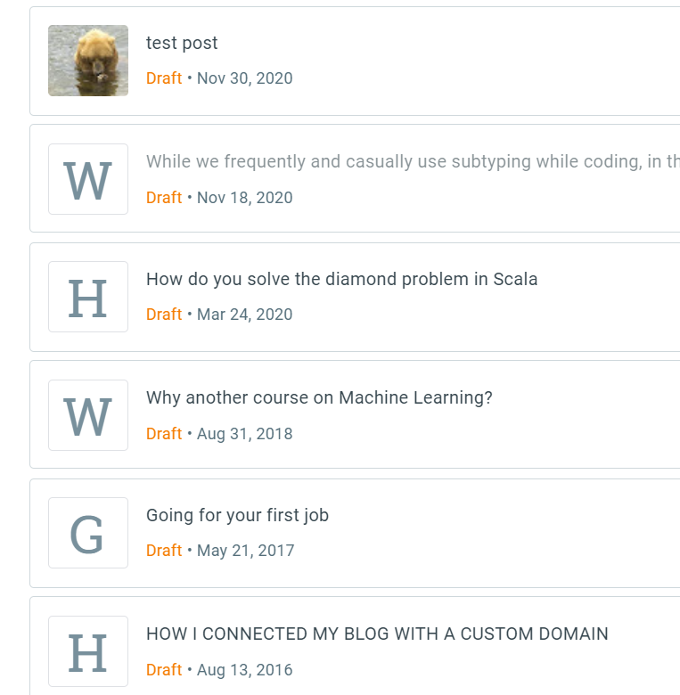
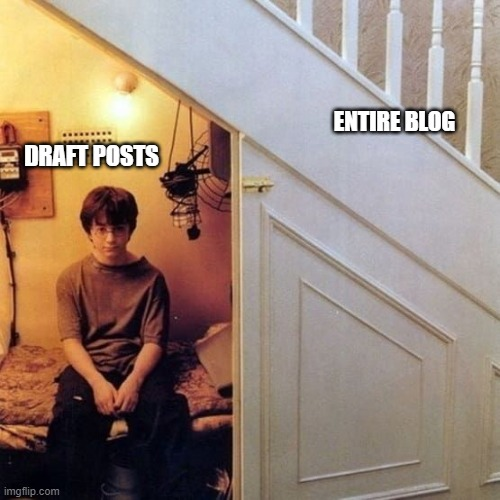
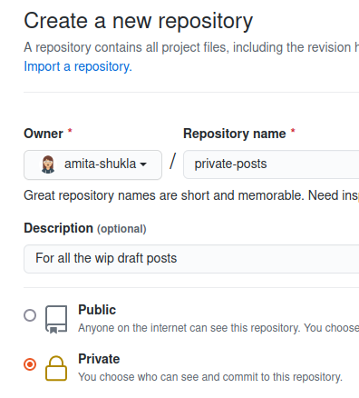

In this post I talk about how I manage to keep some of my posts private while keeping everything else part of a public repository. 

[You Can Skip Intro by Clicking Here.](#lets-begin)

A few months before [I launched my blog on a fresh platform](https://amitashukla.in/blog/announcing-an-all-new-and-improved-site/). Instead of using Blogger, I shifted to the Static Site Generator Gatsby, and uploaded all the code, as well as the content on Github. This is the reason that all the activites of this open sourced blog are public. There is nothing wrong with that, except a small issue. I realized I was missing out on the one flexibility offered by Blogger that I was taking for granted, DRAFT POSTS! 

For example, these were my pending posts on Blogger: 



The above list is nothing compared to what I had before the Grand Cleanup: I carried out a <a href="https://en.wikipedia.org/wiki/Swachh_Bharat_Mission" target="_blank">Swachhata Abhiyan</a> and deleted the posts that were never meant to be written. It doesn't mean that these posts were meant to be published, it was just that I had added some content to these and I didn't feel like losing them. Well, let bygones be bygones.

It took me a lot of courage though to post the above list. Maybe I shall carry out another Swachhata Abhiyan and delete this post as well, so if you're viewing this, then you're probably looking at a limited edition post... 

I never realized before making this blog/project public that it would also mean that my draft posts will become public too. I had a few options now:
1.    Just put up my posts out there, in a directory named 'drafts'. Who is gonna visit your profile anyway! And whoever does look, they can, and let's be positive here, give me positive feedback.

2.    Do not commit the draft posts at all, just keep them in your local system (recommended by the author from whom I forked this project).

Both the above approaches did not sound good to me:

1.  Well, just like I dress in a presentable way in public, I also like my posts' content to be presentable in public. Of course, not all the code in all my repos is presentable. But this repository is different in the sense that I talk about this one a lot.  Also, just like I like to change clothes privately, I like to write posts privately.

<p>
<center></img></center>
</p>

2.  The second solution proposed above completely defeats the purpose as well. I need those draft posts everywhere so that I can add on to them as soon as I get an idea. 

<p>

So here is the principle I came up with. 

The repo that is behind this blog always contains published content. With that, the other development efforts that go into the repo are public too (check out [this](https://github.com/amita-shukla/blog-1/issues) list of issues). But, the drafts need to be hidden. They wield a lot of power (of destroying my image of writing well-thought-out posts) to be allowed to be in open like that. 



##<a name="lets-begin">Let's Begin.</a>

Here is the flow I am working on currently to manage my private posts hosted on GitHub. 

> The idea is to keep two remotes, one public for everything published, and another private for draft posts (or any codebase that I wish to keep private).

### 1. **Create a private repository** on Github.



### 2. **Add Private Remote** 
Go to your repository on local, and add another remote called 'private', pointing to the private repository.

```git
cd blog-1/
git remote add private git@github.com:amita-shukla/private-posts.git
```

### 3. **Push code to Private Remote**
Push to this private remote. Now your local code is hosted to two remote repositories, one public and one private.

Now all we need to do is push public content to public remote (`origin`) and private content on private remote (`private`).

Each remote has an associated main branch. For `origin` it is `master`, and for `private` I have set it to `draft`.

```git
git checkout -b draft
git push private draft
```

### 4. **Move to Anchor Branches** 
Every time I start a new post, I first switch from master to draft. 

```git
git checkout master
git checkout draft
```

### 5. **Update Draft Branch** 
Now before I start with anything, this branch needs to be updated with the latest development work on origin.

```git
git pull origin master
git push private draft
```
Now, the two remotes are in sync.

### 6. **Create Feature Branch** 
I make sure that the draft branch remains my anchor branch from where all the new draft post branches can have their own cut. So, from here, I create another branch from the `draft` branch. I follow a format where the post branches start with `post/` prefix.

```git
$ git checkout -b post/how-to-draft-posts
Switched to a new branch 'post/how-to-draft-posts' 
```

### 7. **Code** 
Now starts the regular flow of writing, I create a new directory under `content` directory and in it place the index.md and start writing...

After I am done, I can do my regular testing on local using `gatsby develop` command.

### 8. **Push to Private** 
Now suppose I am not done with this post completely. So, I, very carefully, push this post to the **private** remote repository. Command format: `git push <remote-name> <branch-name>`.

```git
git push private post/how-to-draft-posts
```
Or `git push -u private post/how-to-draft-posts` if doing for the first time. This takes up the current state of the branch and pushes it to the private repository.

The above steps 5-8 I keep following until I am done with my post.

### 9. **Pull Your Work from Private** 
If I am on a different machine and I need to continue with my private post/code, I need to first pull it up. For this, I update my remotes on my local:

```git
git remote update
```
```git
git checkout post/how-to-draft-posts
```    

### 10.  **Push to Origin** 
Now once I am done with the draft, and have tested it locally, I am all set to make it public, and ready to publish. Hence, I push my code to origin.

```git
git push -u origin post/how-to-draft-posts
```

### 11.  **Create Pull Request** 
Next, continuing with the usual flow, create a pull request, the code now being ready to be merged to master.

## *Fin.*
The idea of keeping two remotes sounds quite complicated, but keeping the public/private remote division in my mind helps me to push the right code to the right place. 

After coming up with this idea, I researched more into how other people are doing it. Surely, I can't be the first person facing this problem! And as always, there were other people working on it too. I came across [this](https://24ways.org/2013/keeping-parts-of-your-codebase-private-on-github/) post which was just what I needed. Somebody who has already done successfully what I was thinking of gave me the confidence to go ahead. If my post was not clear, I would definitely recommend checking this post out.
