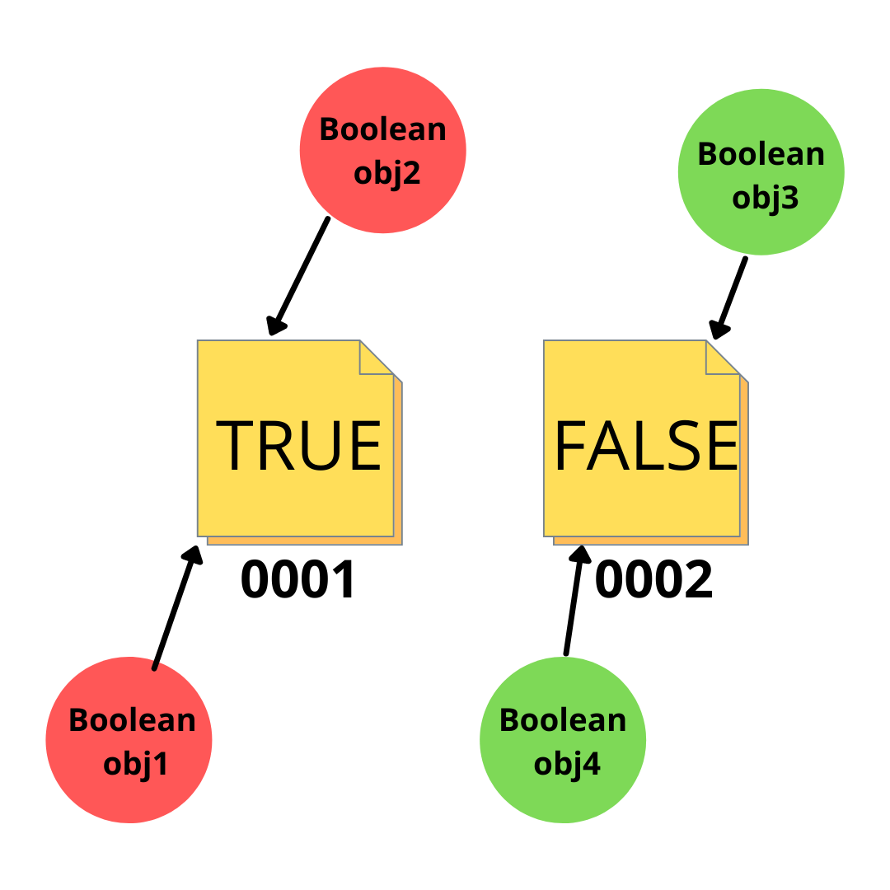

There is ample material on how we can use constructors to create new objects, but still we can opt out the use of constructors somtimes. In the object oriented world, where everything is an object, some need not be so. 

It is obvious to use the `new` keyword, as the only way to deal with an object. But we may not want that all the time. L'ets consider a very common scenario of `Boolean`. We know that a boolean value represents one of the two values, `true` or `false`. When we attempt to create a boxed type for the same, we can create a `Boolean` object like this:

```java
class Boolean {
  boolean value;
  Boolean (boolean val){
    this.val = val;
  }
}
```

Let's try to instantiate it now:
```java
Boolean t = new Boolean(true);
Boolean t2 = new Boolean(true);
```

For the same value `true` we have now created the two objects. Is this ok? 

## Problems
While the above code is alright, it has some major problems:

1. The class design is conceptually wrong. Here, `t` and `t2`, even though they contain the same value `true`, the condtion `t==t2` is going to return `false` coz ultimately they are different objects. To resolve this, we need to implement the `equals` method:

```java
boolean equals(Boolean b){
  return b.val == this.val ? true : false;
}
```

Now we need to use `equals` method for `Boolean` object comparison: `t.equals(t2) //true`. You see for such a simple object as Boolean, we have to add this extra complexity.

2. The second problem is the practical problem, and that is, afterall how much memory are we going to allocate to all the objects created in a huge program that uses it just for saving `true` or `false`? So you see, in this case, we don't actually need so many instances of boolean values, but just two,

We therefore make use of a **static factory method** for this class:

```java
public Boolean {
  private boolean value;
  
  // make the constructor private
  private Boolean(boolean value) {this.value = value}

  // create two true and false objects, which are static
  private static Boolean TRUE = new Boolean(true);
  private static Boolean FALSE = new Boolean(false);

  // create static factory to access the above
  public static Boolean valueOf(boolean b){
    return b ? Boolean.TRUE : Boolean.FALSE; 
  }
}
```


## Advantages

As in the example above, static factory methods are some of the most commonly used guidelines for such cases. It can help us with:

1. Like in the above case, when we have one of a fixed number of items to choose from. If we have more than 2 choices, we can also create a map of `<Val, Type>` and return the valid values from there. 

2. Static Factory methods can also help us with Singleton classes, where we always need to return a single object. By convention a `getInstance` method is created, that returns the same instance each time it is called.
   
3. Another benefit is that we can returning some specific implementation of the class, depending on some criteria. While a constructor returns an instance of the object it is called in, with a static factory method we can return different implementations of the object depending upon some logic. 

For example, consider the method `unmodifiableSet` from `Collections.java` that takes a `Set` and returns a non-public implementation called `UnmodifiableSet`:

```java
public static <T> Set<T> unmodifiableSet(Set<? extends T> s) {
        return new UnmodifiableSet<>(s);
}
```

However, the return type of the above method is kept `Set`, but it will throw an `UnsupportedOperationException` when methods such as `add`, `remove` are called on it.

## Conclusion

Hope the Static Factory Methods are a bit clearer now. We need not always use them in place of Constructors, but they're nice to have when constructors fall short. It's important to understand when to use what. 

This post actually comes from my old notes on Chapter 2 of the Effective Java book, a must read for all programmers who want to level up in the field.

