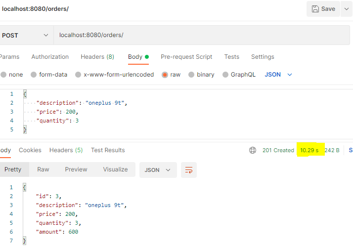
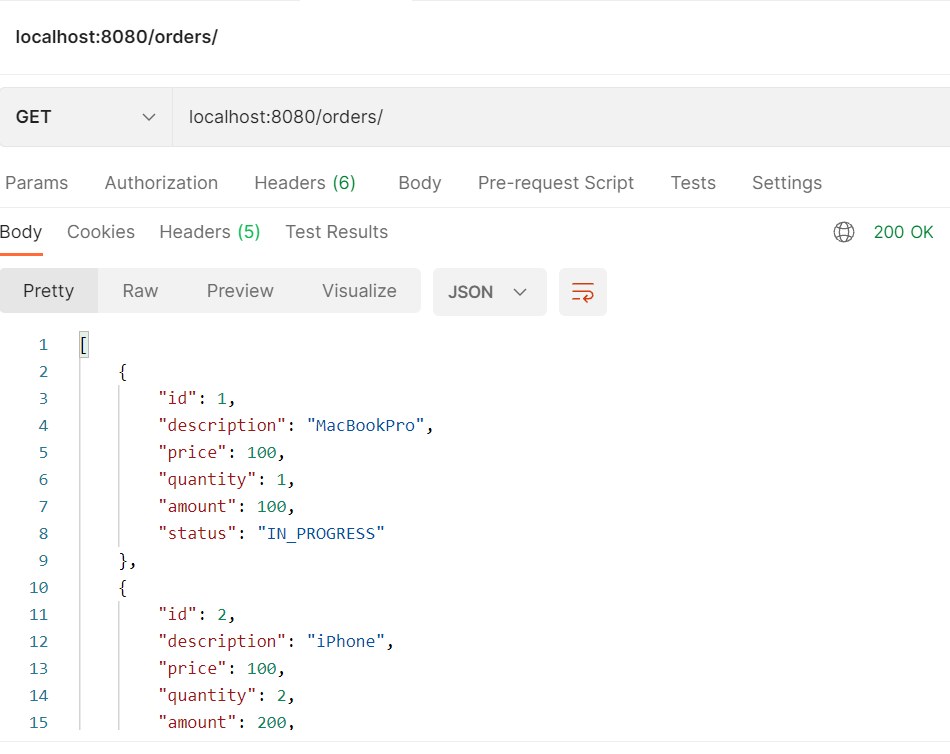
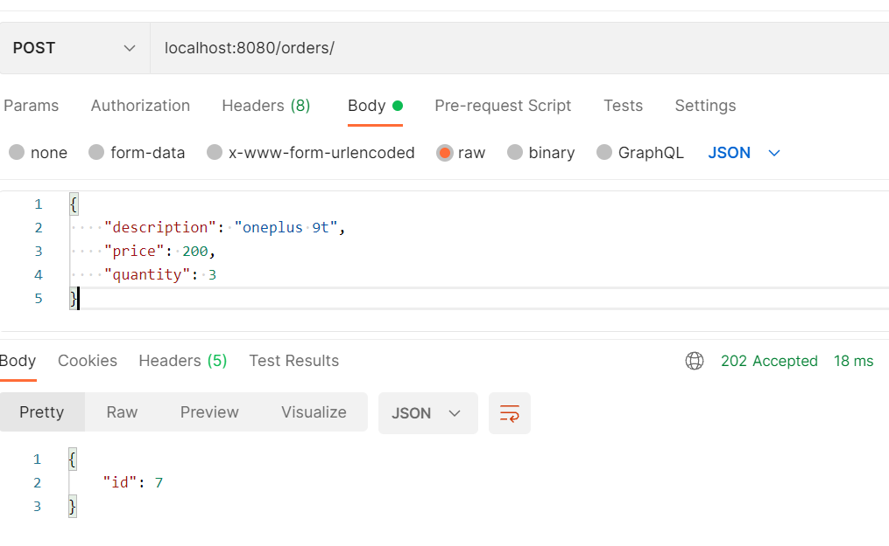
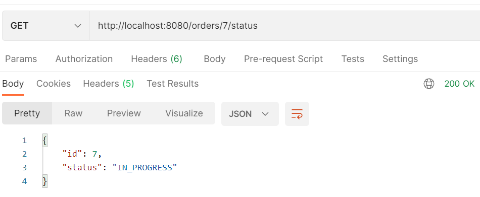
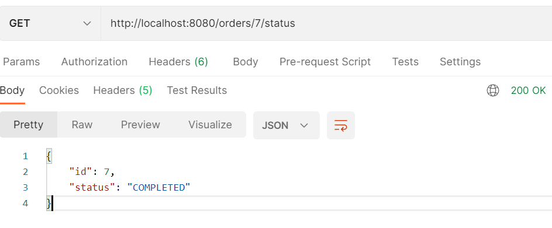

In previous post [Rest API For Long Running Job](https://amitashukla.in/blog/rest-api-for-long-running-jobs/) we discussed the design of an API exposed to handle long runnining jobs. Such an API decouples the long running process with the actual API, and instead of indefinitely waiting for a response we expose a `/status` endpoint to monitor the progress of the running task.

In this post we will implement such an API. 

## Simple API Structure
Let's first start with implementing a simple API, when the long running job is not in the picture. I will be using Java with Spring for this purpose. If you wish to directly jump to the implementation of the long runnning API, you can click [here](#long-running-impl).

### Define Order Entity
Let's start by defining an entity `Order`. We name the table name as `customer_order` as Order is not a valid name for a table (We are using the H2 database here for simplicity). The customer_order table has 5 columns, `id` being the primary key, `description`, `price`, `quantity` and `amount`.

```java
@Entity
@Table(name = "customer_order") // 'order' is not a valid table name
@Getter @Setter @NoArgsConstructor
public class Order {
    private @Id Long id;
    private String description;

    private Integer price;
    private Integer quantity;
    private Integer amount;

    public Order(Long id, String description, Integer price, Integer quantity, Integer amount) {
        this.id = id;
        this.description = description;
        this.price = price;
        this.quantity = quantity;
        this.amount = amount;
    }

    @Override
    public boolean equals(Object o) {
        if (this == o) return true;
        if (!(o instanceof Order)) return false;
        Order order = (Order) o;
        return Objects.equals(id, order.id) && Objects.equals(description, order.description) && Objects.equals(price, order.price) && Objects.equals(quantity, order.quantity) && Objects.equals(amount, order.amount);
    }

    @Override
    public int hashCode() {
        return Objects.hash(id, description, price, quantity, amount);
    }

    @Override
    public String toString() {
        return "Order{" +
                "id=" + id +
                ", description='" + description + '\'' +
                ", price=" + price +
                ", quantity=" + quantity +
                ", amount=" + amount +
                '}';
    }
}
```

### Define Order Repository
Let's define an `OrderRepository` for introducing database operations on this entity:
```java
public interface OrderRepository extends JpaRepository<Order, Long> {
}
```

### Define REST Endpoints
We take the order description, price and quantity as input, and generate the value of the `id` column each time a new order is created. **Assume that the calculation of the `amount` is a time taking operation**. As long as the amount has not been populated, the order creation is not considered complete.

Let's define the endpoints `GET /orders`, `POST /orders` and `GET /orders/{id}` on  `OrderController.java`:
```java
@RestController
@Slf4j
public class OrderController {
    @Autowired
    OrderRepository repository;

    @Autowired
    OrderCreationService orderCreationService;

    @GetMapping("/orders")
    public ResponseEntity<Order> all(){
        return ResponseEntity.ok(repository.findAll());
    }

    @PostMapping("/orders")
    public ResponseEntity<Order> newOrder(@RequestBody Order order){
        order.setId(orderCreationService.generateOrderId());
        repository.save(order);
        // LONG RUNNING TASK!!!
        orderCreationService.createOrder(order);
        return ResponseEntity.status(HttpStatus.CREATED).body(order);
    }

    @GetMapping("/orders/{id}")
    public ResponseEntity<Order> getOrder(@PathVariable Long id) {
        Order order = repository.findById(id)
                .orElseThrow(() ->
                        new ResponseStatusException(HttpStatus.NOT_FOUND, new OrderNotFoundException(id).getMessage()));

        return ResponseEntity.ok(order);
    }
}
```

### Define Long Running Operation
We have a service `OrderCreationService.java` that deals with the long running operation of order creation. Here, we calculate the amount and to deliberately make this slow, we make the method sleep for 10 seconds in between:

```java
@Component
@Slf4j
public class OrderCreationService {
    @Autowired
    OrderRepository orderRepository;

    public void createOrder(Order order) {
        Long id = order.getId();
        try {
            // sleep this thread for 10 seconds now
            Thread.sleep(10000);
            if (order.getPrice() < 0) throw new ValidationException("Price must not be negative");
            if (order.getQuantity() < 0) throw new ValidationException("Quantity can not be negative");
            order.setAmount(order.getPrice() * order.getQuantity());
        } catch (Exception e) {
            log.error("Job failed");
            throw new RuntimeException(e);
        } finally {
            orderRepository.save(order);
        }
    }

    public Long generateOrderId(){
        return orderRepository.count()+ 1L;
    }
}
```

> Before you point this out, let me say I understand that we can make the `id` column autogenerated, but I have kept a seperate method for this as I wish to generate the id before saving it to the repository, to keep in line with the implementaion I will be doing later. Also, yes, I am not proud of the `orderRepository.count()+1L` there either.

### The Problem

As expected, the `POST /orders` endpoint is going to take a long time before it returns. All this time, the caller needs to wait for the result, unable to take any other action:

Consider the highlighted 10s it takes for this query to complete.

As discussed in detail in [my previous post](https://amitashukla.in/blog/rest-api-for-long-running-jobs/), when using this application on production, usually a system wide or project timeout is placed. This will cause our Order creation process to fail, as it's going to take atleast 10 seconds. Even if the timeouts are not in place, it's a bad user experience.

## <a name="long-running-impl">Implementing API for such Long Running Tasks</a>
With initial setup out of the way, let's move on to modify this API to support such long running operations. Following is the flow we're trying to implement, observe how the POST request immediately returns.
 

We introduce another column `Status`, using which we will track the status of the order creation:
```java
public enum Status {
    IN_PROGRESS,
    COMPLETED,
    CANCELLED,
    FAILED
}
```
Let's add this status to our table:
```java
@Entity
@Table(name = "customer_order")
@Getter @Setter @NoArgsConstructor
public class Order {
    private @Id Long id;
    private String description;

    private Integer price;
    private Integer quantity;
    private Integer amount;
    private Status status;

    public Order(Long id, String description, Integer price, Integer quantity, Integer amount, Status status) {
        this.id = id;
        this.description = description;
        this.price = price;
        this.quantity = quantity;
        this.amount = amount;
        this.status = status;
    }

    // EQUALS, HASHCODE AND TOSTRING modified to include status column
    // ...
}

```
### Modify POST endpoint
We now change the POST endpoint to return the response immediately, trigger the async job, and set the status depending upon the stage in which the long running process in:
```java
@PostMapping("/orders")
public ResponseEntity<OrderCreationResponse> newOrder(@RequestBody Order order){
    order.setStatus(Status.IN_PROGRESS);
    order.setId(orderCreationService.generateOrderId());
    repository.save(order);

    log.info("Triggering creation async job...");
    orderCreationService.createOrder(order);
    return ResponseEntity.accepted().body(new OrderCreationResponse(order.getId()));
}
```

Let's go over the changes made here:
#### Response Code
Now when the POST `/orders` is called, instead of sending the `201 CREATED`  response, I will now send back `202 ACCEPTED`. This indicates that we have accepted the request to create an order, however we may or may not have actually created the resource.

#### Response Data
Alongwith the above response code, we generate and send back the `id`. This `id` is used as the token to keep track of this particular request. For this, I now will return another object `ObjectCreationResponse`:
```java
@Getter @Setter @AllArgsConstructor
public class OrderCreationResponse {
    private Long id;
}
``` 

#### Set Status of the Creation Process
We then change the status to `IN_PROGRESS`. 
We save this not-yet-fully-created order object to the repostory, so the object against the generated id can be tracked and updated further as the creation proceeds. 
```java
order.setStatus(Status.IN_PROGRESS);
order.setId(orderCreationService.generateOrderId());
repository.save(order);
```

#### Making the Long Running Job Asynchronous
Now once we set the job in progress, we move it to run in the background in the `OrderCreationService`:
```java
@Async
public void createOrder(Order order) {
    Long id = order.getId();
    try {
        Thread.sleep(10000);
        if (order.getPrice() < 0) throw new ValidationException("Price must not be negative");
        if (order.getQuantity() < 0) throw new ValidationException("Quantity can not be negative");
        order.setAmount(order.getPrice() * order.getQuantity());
        order.setStatus(Status.COMPLETED);
        log.info("Async job completed");
    } catch (Exception e) {
        order.setStatus(Status.FAILED);
        log.error("Job failed");
        throw new RuntimeException(e);
    } finally {
        orderRepository.save(order);
    }
}
```
We mark the status as `Status.COMPLETED` at the end of the `try` block, or `Status.FAILED` if in the `catch` block. We make sure this status gets saved by using `orderRepositor.save(order)` in the `finally` block.

#### Trigger the Asynchornous Job and Return ID
Now in order for this endpoint to return immediately, we need to call `createOrder` asynchronously.
```java
log.info("Triggering creation async job...");
orderCreationService.createOrder(order);
```

### Add Endpoint to Get Job Status
Once we have received an `id` back from the POST `/orders` request, we now expose an endpoint that can be polled to return the status of the background job:
```java
@GetMapping("/orders/{id}/status")
public ResponseEntity<OrderStatus> getOrderStatus(@PathVariable Long id){
    Order order = repository.findById(id).orElseThrow(() -> new OrderNotFoundException(id));
    Status status = order.getStatus();
    return ResponseEntity.ok(new OrderStatus(id, status));
}
```
Here the `OrderStatus` is the object returning the id and the corresponsing status:
```java
@Getter @Setter @AllArgsConstructor
public class OrderStatus {
    private Long id;
    private Status status;
}
```
### Add Endpoint to Get Job Result
After we receive `status: COMPLETE` from the `/orders/{id}/status`, when we can finally get the object details by exposing a new `/orders/{id}/result` endpoint:
```java
@GetMapping("/orders/{id}/result")
public ResponseEntity<Order> getOrderResult(@PathVariable Long id){
    Order order = repository.findById(id).orElseThrow(() -> new OrderNotFoundException(id));
    if(!order.getStatus().equals(Status.COMPLETED)){
        return ResponseEntity.status(HttpStatus.METHOD_NOT_ALLOWED).build();
    }
    return ResponseEntity.ok(order);
}
```
Observe that the response body is of the type `Order` here. We no more need the `GET /orders/{id}` endpoint, as this one will only display the order details after the job has completed.

## Demo Time
#### Get All Orders
The `/orders` endpoint works as expected, returns the list of all order details.

#### Create An Order
Now we hit a `POST` request to create a new Order. Observe that we receive the response code `202 Accepted`. In response we receive the `id` of the new order being created.

#### Get Order Status
Let's now check the status of this order. We will keep seeing the `IN_PROGRESS` status as long as the background job completes:

#### Poll Status Until Completed
We keep polling until we see the `COMPLETED` status:

#### Get Results
Now let's get the results to get the actual order details. Here the `amount` is generated for the given order.


## Conclusion
So far, we have implemented the basic flow, with the necessary endpoints to make it work. However, a production level API is far more complicated than this. Generally, it is a good idea to separate the `id`s logically, i.e. have an id such as `taskId` or `transactionId` which is solely maintained for the purposes for tracking a long running job, and a  resource id such as `orderId` here, used for idenitfying that particular resource. When we implement it like this, we can design this further to put an in-memory DB for even quicker tracking of long running processes instead of making rounds to our main product database.

Also, this implementation paves the way to further provide the ability to the user to cancel a job they triggered. We need to apply sufficient protective measures as well ir order to protect an API from crashing.

It is also easy to see that this API has become more complicated, but this can be reduced by documenting the API (obviously) as well as implementing the API in such a way that the users a directed to the next endpoint (Hint: HATEOAS). If time permits, I shall expand this in a further post. 
