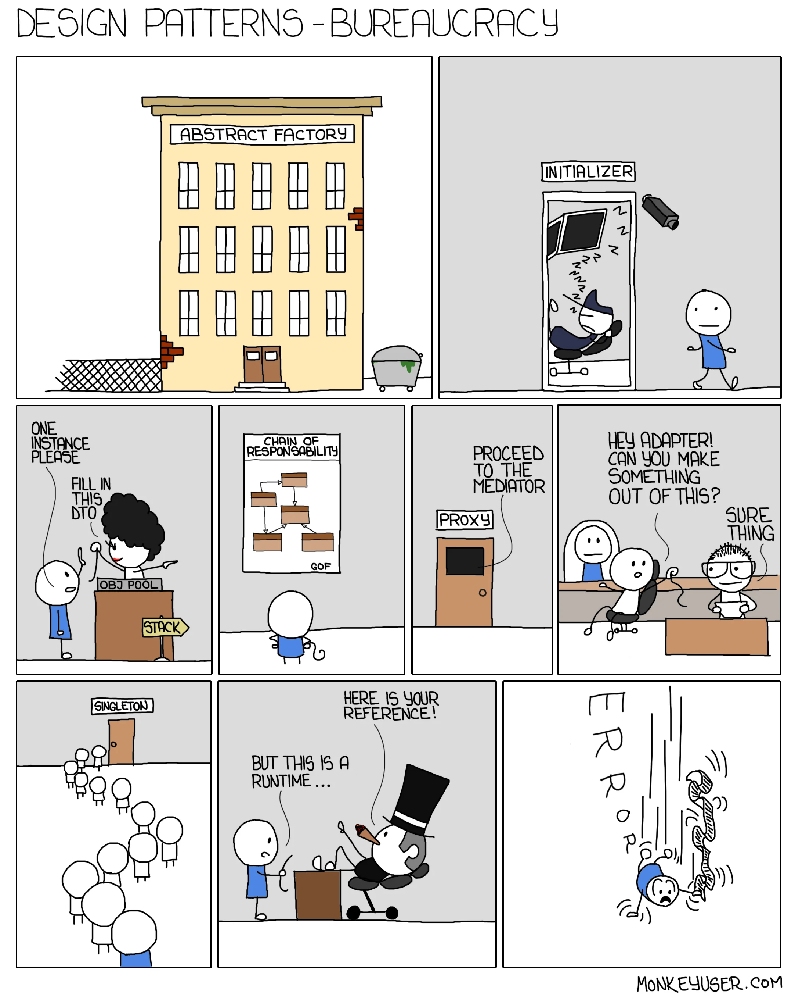

Understanding design patterns is best achieved through practical application. However, we often miss how they're built into the frameworks or libraries we use. In Spring Framework, different design patterns are used to make applications flexible and easy to maintain. Sometimes we use these patterns unknowingly. Let's explore the below design patterns to understand how they work in real-world applications:

<a href="#dependency-injection-di--inversion-of-control-ioc">1. Dependency Injection (DI) / Inversion of Control (IoC)</a><br>
<a href="#creating-beans-using-factory-pattern">2. Creating Beans using Factory Pattern</a><br>
<a href="#singleton-scope-for-beans-per-container-per-bean">3. Singleton Scope for Beans (per container per bean)</a><br>
<a href="#the-prototype-scope-for-beans">4. The Prototype Scope for Beans</a><br>
<a href="#spring-aop-using-proxy-pattern">5. Spring AOP using Proxy Pattern</a><br>
<a href="#template-method-pattern-in-jdbctemplate">6. Template Method Pattern in JdbcTemplate</a><br>
<a href="#event-handling-using-observer-pattern">7. Event Handling using Observer Pattern</a><br>
<a href="#transaction-management-using-strategy-pattern">8. Transaction Management using Strategy Pattern</a><br>
<a href="#configuration-parsing-using-composite-pattern">9. Configuration Parsing using Composite Pattern</a><br>
<a href="#build-restclient-using-builder-pattern">10. Build RestClient using Builder Pattern</a><br>

### Dependency Injection (DI) / Inversion of Control (IoC)

Central to the Spring Framework, DI/IoC allows objects to be constructed and wired together by an external entity (the Spring container), rather than within the objects themselves. IoC is not a design pattern per se, but a design principle, which the Spring framework implements using Dependency Injection. It's so core to the spring's functionality that I thought its worth starting this list with it before proceeding to 'official' patterns.

#### Inversion of Control
Ioc refers to transferring the control of objects and their dependencies from the main program to a container framework.

#### Dependency Injection
Dependency Injection is a technique that allows objects to be separated from objects they depend upon. e.g. an object `A` requires a method of object `B` to complete its functionality. In dependency injection, instead of creating an instance of class `B` in class `A` using the `new` operator, the object of class `B` should be injected in class `A` using either:
- Constructor injection
- Setter injection
- Interface injection

Let's see DI in action. Tradionally, we have a class defined like this:
```java
public class MyApplication {
    private final MessageService messageService;

    public MyApplication(MessageService messageService) {
        this.messageService = new EmailService();
    }

    public void processMessage() {
        System.out.println(messageService.getMessage());
    }
}
```
In Spring, we can do the same like:
```java
@Component
public class MyApplication {
    private final MessageService messageService; 

    @Autowired
    public MyApplication(MessageService messageService) {
        this.messageService = messageService; // an object of type EmailService is automatically injected by Spring.
    }

    public void processMessage() {
        System.out.println(messageService.getMessage());
    }
}

public interface MessageService {
    String getMessage();
}

@Component
public class EmailService implements MessageService {
    public String getMessage() {
        return "Email message";
    }
}
```

Now, here we do not need to instantiate `EmailService` inside `MyApplication`, spring handles it. How? As `EmailService` is registered as a component (which makes it a bean), it is automatically injected by Spring. 

Note: If there are more than one type of `MessageService` defined, then we can either use a `@Qualifier` annotation, or define a Factory to fix the ambiguity.

### Creating Beans using Factory Pattern

#### Bean
In Spring, the objects that form the backbone of your application and that are managed by the Spring IoC container are called beans. 
> A bean is an object that is instantiated, assembled, and managed by a Spring IoC container. 
 
Otherwise, a bean is simply one of many objects in your application. Beans, and the dependencies among them, are reflected in the configuration metadata used by a container.

Spring employs `BeanFactory`, which contains factory methods to create objects, often used in conjunction with DI/IoC to configure and instantiate objects based on their types or other factors.

Depending on the bean definition, the factory returns either an independent instance of a contained object (the Prototype design pattern), or a single shared instance (a superior alternative to the Singleton design pattern, in which the instance is a singleton in the scope of the factory). Which type of instance will be returned depends on the bean factory configuration.

```java
public interface BeanFactory {
    public static <T> T getBean();
    // more methods
}

```

### Singleton Scope for Beans (per container per bean)

Spring beans are often configured as singletons by default, ensuring that only one instance of a bean exists per container. This promotes efficient resource usage and consistent state management.

The latest version of the Spring framework defines six types of scopes - singleton, prototype, request, session, application, and websocket. The scope of bean defines its lifecycle and visibility. 

```java
@Configuration // A class marked @Configuration means it is the source of bean definitions.
public class MyBeanConfig {

    @Bean
    public SingletonBean MyBean() {
        return new MyBean(); // the object returned here is singleton by default
    }

}
```

However, it is a little different from the standard singleton pattern. As mentioned in [Spring Docs](https://docs.spring.io/spring-framework/reference/core/beans/factory-scopes.html#beans-factory-scopes-singleton):
> Spring’s concept of a singleton bean differs from the singleton pattern as defined in the Gang of Four (GoF) patterns book. The GoF singleton hard-codes the scope of an object such that one and only one instance of a particular class is created per ClassLoader. The scope of the Spring singleton is best described as being per-container and per-bean. This means that, if you define one bean for a particular class in a single Spring container, the Spring container creates one and only one instance of the class defined by that bean definition.

### The Prototype Scope for Beans

#### The Prototype Pattern
The prototype pattern lets you copy exising objects without making your code dependent on their classes. A prototype usually contains a method `clone()`, that contains the cloning logic in the same class.

In Spring, when a bean is scoped as a prototype, a new instance of the bean is created every time it is requested from the container. This aligns with the Prototype pattern, where new instances are created based on an existing instance.

The below code defines a bean with `prototype` scope:
```java
@Bean
@Scope("prototype")
public Person personPrototype() {
    return new Person();
}
```

### Spring AOP using Proxy Pattern

A proxy is anything that represents anything else. Most commonly we use it for Proxy Servers - which is basically a server that acts as an intermediary between a client and another server - provding security, privacy or performance.

#### Proxy Pattern
A proxy pattern is applied when we want to impersonate a class to add more things on top of what it does. Suppose, a function is compute heavy, and you would like it to only run when its value is not already cached. In that case, we use proxy pattern to add caching capability to it. 

Spring AOP (Aspect-Oriented Programming) utilizes dynamic proxies to apply cross-cutting concerns, such as logging, security, and transaction management, to target objects without modifying their code directly. Let's discuss a few common annotations and how they're implemented:
- `@Cacheable`: Spring uses AOP to intercept method calls, check if the result is already in the cache, and either return the cached result or execute the method and cache the result.
- `@Async`: When a method annotated with @Async is called, Spring creates a proxy around the method and executes it in a separate thread. Spring manages the thread pool and ensures that the asynchronous method is executed asynchronously without blocking the calling thread.
- `@Transactional`: When a method annotated with @Transactional is called, Spring intercepts the method invocation and starts a transaction before executing the method. After the method completes, Spring commits the transaction if the method execution was successful, or rolls back the transaction if an exception occurred during method execution.

The creation of proxy classes involves the use of dynamic proxy or CGLIB proxy depending on whether the target class implements interfaces or not.
#### JDK Dynamic Proxies
- When the target class implements interfaces, Spring uses JDK dynamic proxies.
- Spring generates a proxy class at runtime that implements the same interfaces as the target class.
- The proxy class intercepts method calls and delegates them to the actual target object.
- Method invocations on the proxy are forwarded to an InvocationHandler, where the additional logic specified by the annotations is applied.

#### CGLIB Proxies
- When the target class does not implement interfaces, Spring falls back to using CGLIB proxies.
- CGLIB generates a subclass of the target class at runtime.
- The generated subclass overrides the target class's methods to apply the behavior specified by the annotations.

### Template Method Pattern in JdbcTemplate

#### Template Method Pattern
Using template pattern, we define the skeleton of an alogorithm in a superclass, but let the subclasses define the implmentation of the same. The key idea behind the template method pattern is to provide a reusable framework for defining algorithms while allowing flexibility for subclasses to tailor specific parts of the algorithm to their needs.
For example, when executing a query on a database, the same series of steps must be completed:
- Establish a connection
- Execute query
- Perform cleanup
- Close the connection

Spring's template classes such as `JdbcTemplate`, `JmsTemplate`(Java Messaging Service), `HibernateTemplate`(deprecated) encapsulate common operations, providing a template method that can be customized by subclasses to execute specific logic. A popular use we mostly see is multiple database providers providing their specific implemntation to execute database commands through `JdbcTemplate`.

```java
class JdbcTemplate {
  Connection createConnectionProxy(Connection con) {...}
  void execute(final String sql) {
    try {
      cs = csc.createCallableStatement(con);
			T result = action.doInCallableStatement(cs);
    } catch (...) {
      JdbcUtils.closeStatement(cs);
			DataSourceUtils.releaseConnection(con, getDataSource());
    }
  }
}
```
```java
class JmsTemplate {
  public <T> T execute() {
    try {
      Session sessionToUse = ConnectionFactoryUtils.doGetTransactionalSession(...);
      return action.doInJms(sessionToUse);
    } catch (...) {
      ...
    } finally {
      JmsUtils.closeSession(sessionToClose);
			ConnectionFactoryUtils.releaseConnection(conToClose, getConnectionFactory(), startConnection);
    }
  }
}
```

### Event Handling using Observer Pattern

#### Observer Pattern
Observer Pattern can also be called publisher and subscriber pattern. It defines a one-to-many dependency between objects so that when one object changes state, all its dependents are notified and updated automatically. 


Spring's event handling mechanism allows beans to publish events and other beans to subscribe to these events, enabling loosely coupled communication between components. Any bean in Spring implements the `ApplicationListener` interface (the observer), will receive an `ApplicationEvent` everytime it is published by a publisher (the subject). 

```java
public interface ApplicationContext extends ... ApplicationEventPublisher { }

public abstract class AbstractApplicationContext {

  // all lifecycle events are published, e.g.
  public void start() {
    getLifecycleProcessor().start();
    publishEvent(new ContextStartedEvent(this));
  }

  public void stop() {
    getLifecycleProcessor().stop();
    publishEvent(new ContextStoppedEvent(this));
  }

  protected void finishRefresh() {
    resetCommonCaches();
    clearResourceCaches();
    initLifecycleProcessor();
    getLifecycleProcessor().onRefresh();

    // Publish the final event.
    publishEvent(new ContextRefreshedEvent(this));
  }

}
```

### Transaction Management using Strategy Pattern
The Strategy Design Pattern is used in the Spring Framework to define a family of algorithms, encapsulate each one, and make them interchangeable. The strategy pattern allows the algorithm to vary independently from the clients that use it.

Spring's various strategies, such as transaction management strategies, enable developers to plug in different implementations at runtime based on configuration or conditions. It defines `PlatformTransactionManager` being the strategy interface for transaction management. Different implementations of `PlatformTransactionManager` allow the use of different transaction management strategies (`JTA`, `JDBC`, `Hibernate`, etc.).

```java
public interface PlatformTransactionManager {
  TransactionStatus getTransaction(TransactionDefinition definition) throws TransactionException;
  void commit(TransactionStatus status) throws TransactionException;
  void rollback(TransactionStatus status) throws TransactionException;
}

```
Here's how JDBC defines `DataSourceTransactionManager` to define its transaction logic:

```java
public class DataSourceTransactionManager extends AbstractPlatformTransactionManager
  implements ResourceTransactionManager, BeanFactoryAware {
    
    // Actual transaction management logic for JDBC
}
```
Now, we configure to use the JDBC strategy:
```java
@Configuration
public class TransactionManagerConfig {
    @Bean
    public PlatformTransactionManager transactionManager(DataSource dataSource) {
        return new DataSourceTransactionManager(dataSource);
    }
}
```


### Configuration Parsing using Composite Pattern

#### Composite Pattern
Composite is a structural design pattern that lets you compose objects into tree structures and then work with these structures as if they were individual objects. It's similar to modelling objects into tree-like structure, where we have a `Leaf` object, and a `Composite` object containing a list of leaves `List<Leaf>`. We have a structure as follows:

```java
interface TreeNode {
  printTree();
}
class Leaf implement TreeNode {}
class CompositeTree implement TreeNode{
  List<Leaf> leaves;
}

class Client {
  public static void main() {
    TreeNode leaf1 = new Leaf();
    TreeNode leaf2 = new Leaf();
    TreeNode root = new Composite();
    root.addLeaf(leaf1);
    root.addLeaf(leaf2);

    root.printTree(); // prints the entire tree
  }
}
```

The Composite Design Pattern in the Spring Framework is used to treat individual objects and compositions of objects uniformly, by allowing you to build a tree structure of objects and perform operations on them. This pattern is especially useful for handling hierarchical data or representing part-whole hierarchies. 

For example, In the Spring Framework, `CompositeComponentDefinition` and `ComponentDefinition` are used to represent and manage complex configuration metadata. They facilitate grouping related configuration elements together, enabling Spring to handle complex configurations more effectively.
```java
interface ComponentDefinition {
	String getName();
	String getDescription();
	BeanDefinition[] getBeanDefinitions();
	BeanDefinition[] getInnerBeanDefinitions();
	BeanReference[] getBeanReferences();
}

abstract class AbstractComponentDefinition implements ComponentDefinition { }

class CompositeComponentDefinition extends AbstractComponentDefinition {
	String name;
	Object source;
	List<ComponentDefinition> nestedComponents = new ArrayList<>();

	public CompositeComponentDefinition(String name, @Nullable Object source) {
		this.name = name;
		this.source = source;
	}

	public void addNestedComponent(ComponentDefinition component) {
		this.nestedComponents.add(component);
	}
}

class ConfigBeanDefinitionParser {
	public void parse(Element element, ParserContext context) {
		CompositeComponentDefinition compositeDef =
				new CompositeComponentDefinition(element.getTagName(), parserContext.extractSource(element));
		parserContext.pushContainingComponent(compositeDef);

		List<Element> childElts = DomUtils.getChildElements(element);

		for (Element elt: childElts) {
			// register bean definitions of all child elements...
		}
		parserContext.popAndRegisterContainingComponent();
	}
}
```

### Build RestClient using Builder Pattern

I have used the builder pattern so often with Lombok's `@Builder` annotation that it has become my goto choice for object instantiation. In spring, one of the common examples of builder pattern is the introduction of `RestClient` in Spring Boot 3.2 to ultimately replace the `RestTemplate`, which offers an intuitive Fluent API to make Rest calls. 

The `RestClient` is based on the functional and fluent style api. It implements its own `Builder` class, which is then implemented by `DefaultRestClientBuilder` to build a `DefaultRestClient`.

```java
public interface RestClient {

  static RestClient create() {
    return new DefaultRestClientBuilder().build();
  }

  interface Builder {
    RestClient build();
  }
}

final class DefaultRestClientBuilder implements RestClient.Builder {

  @Override
  public RestClient build() {
    ClientHttpRequestFactory requestFactory = initRequestFactory();
    UriBuilderFactory uriBuilderFactory = initUriBuilderFactory();
    HttpHeaders defaultHeaders = copyDefaultHeaders();
    List<HttpMessageConverter<?>> messageConverters = (this.messageConverters != null ?
				this.messageConverters : initMessageConverters());
    return new DefaultRestClient(requestFactory,
        this.interceptors, this.initializers, uriBuilderFactory,
        defaultHeaders,
        this.defaultRequest,
        this.statusHandlers,
        messageConverters,
        this.observationRegistry,
        this.observationConvention,
        new DefaultRestClientBuilder(this)
        );
  }
}
```

### That's all.
This is not an exhaustive list, but some of the main design patterns used within the Spring Framework - contributing to its flexibility, extensibility, and ease of use in developing enterprise applications.

### Read more
- https://www.baeldung.com/inversion-control-and-dependency-injection-in-spring
- https://www.baeldung.com/spring-annotations-resource-inject-autowire
- https://www.baeldung.com/spring-component-repository-service
- https://www.baeldung.com/spring-boot-singleton-vs-beans
- https://www.baeldung.com/java-proxy-pattern
- https://docs.spring.io/spring-framework/docs/4.3.x/spring-framework-reference/html/transaction.html#transaction-intro
- https://github.com/spring-projects/spring-framework/blob/main/spring-web/src/main/java/org/springframework/web/client/DefaultRestClientBuilder.java
- https://www.baeldung.com/java-composite-pattern
- https://github.com/spring-projects/spring-framework/blob/69c44dee9946d3bb1a1aa0ddef16f3226df6acc7/spring-aop/src/main/java/org/springframework/aop/config/ConfigBeanDefinitionParser.java#L421
- https://github.com/spring-projects/spring-framework/blob/69c44dee9946d3bb1a1aa0ddef16f3226df6acc7/spring-context/src/main/java/org/springframework/context/support/AbstractApplicationContext.java
- https://github.com/spring-projects/spring-framework/blob/69c44dee9946d3bb1a1aa0ddef16f3226df6acc7/spring-jms/src/main/java/org/springframework/jms/core/JmsTemplate.java#L489
- https://github.com/spring-projects/spring-framework/blob/69c44dee9946d3bb1a1aa0ddef16f3226df6acc7/spring-jdbc/src/main/java/org/springframework/jdbc/core/JdbcTemplate.java#L1730


