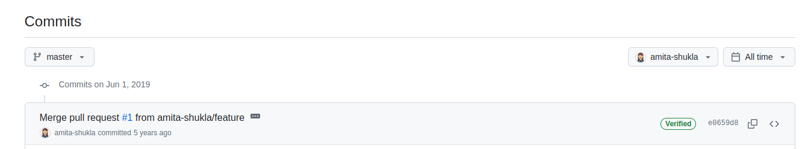
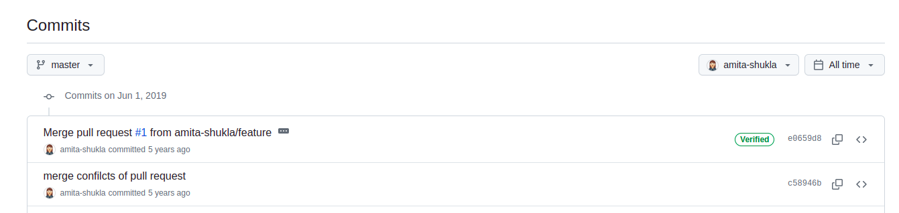
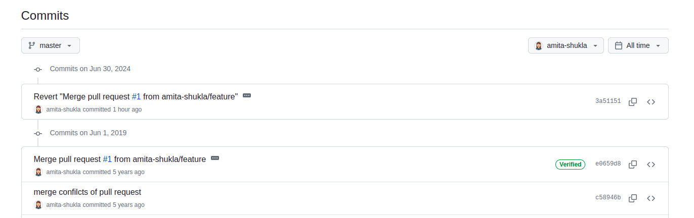
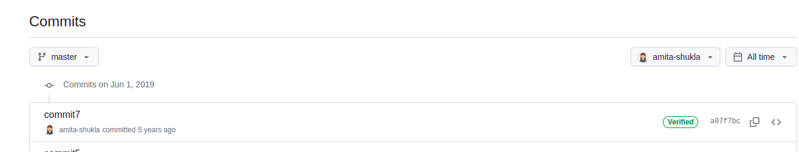

In my previous post [Undo everything in Git - Part 1](https://amitashukla.in/blog/undo-everything-in-git-part-1/), I disucussed various undo scenarios on a git repository locally. Now, in this post, we discuss the undo strategies when we have pushed our code to remote already.

#### Table of Contents
<a href="#undo-a-push">- Undo a Push</a></br>
&nbsp;&nbsp;&nbsp;&nbsp;&nbsp;&nbsp;&nbsp;&nbsp;<a href="#undo-using-git-revert">- undo using git revert</a></br>
&nbsp;&nbsp;&nbsp;&nbsp;&nbsp;&nbsp;&nbsp;&nbsp;<a href="#undo-using-git-reset">- undo using git reset</a></br>
<a href="#undo-a-merge-commit">- Undo a merge commit</a></br>
&nbsp;&nbsp;&nbsp;&nbsp;&nbsp;&nbsp;&nbsp;&nbsp;<a href="#a-merge-commit">- A merge commit</a></br>
&nbsp;&nbsp;&nbsp;&nbsp;&nbsp;&nbsp;&nbsp;&nbsp;<a href="#revert-and-push">- revert and push</a></br>
&nbsp;&nbsp;&nbsp;&nbsp;&nbsp;&nbsp;&nbsp;&nbsp;<a href="#reset-and-force-push">- reset and force push</a></br>
<a href="#undo-a-rebase">- Undo a Rebase</a></br>
&nbsp;&nbsp;&nbsp;&nbsp;&nbsp;&nbsp;&nbsp;&nbsp;<a href="#rebase-didnt-finish">- rebase didn&#39;t finish</a></br>
&nbsp;&nbsp;&nbsp;&nbsp;&nbsp;&nbsp;&nbsp;&nbsp;<a href="#rebase-completed">- rebase completed</a></br>
<a href="#undo-all-work-in-a-branch">- Undo all work in a Branch</a></br>
<a href="#undo-a-deleted-branch">- Undo a Deleted Branch</a></br>
&nbsp;&nbsp;&nbsp;&nbsp;&nbsp;&nbsp;&nbsp;&nbsp;<a href="#if-a-branch-is-available-locally-but-upstream-is-deleted">- if a branch is available locally but upstream is deleted</a></br>
&nbsp;&nbsp;&nbsp;&nbsp;&nbsp;&nbsp;&nbsp;&nbsp;<a href="#if-a-branch-exists-remotely-but-deleted-locally">- if a branch exists remotely but deleted locally</a></br>
&nbsp;&nbsp;&nbsp;&nbsp;&nbsp;&nbsp;&nbsp;&nbsp;<a href="#if-a-branch-is-deleted-both-locally-and-remotely">- if a branch is deleted both locally and remotely</a>

A few things to consider before playing with remote repositories:
- When we go about undoing work that has already been pushed remotely, we stand at risk of breaking the code written by other developers based on our code. It is important to communicate to the team about these changes, run test cases, and get code reviewed by all affected code owners.
- It would be nice to take backup of your current code, if it is not in sync with remote. I a lot of times stash my untracked changes, so that I always have them saved.
- I know we try our best, but working on shared branches can be risky when working with a lot of team members. Undoing work when we're sure no one is relying on our code makes our life simpler. 


### Undo a Push
To make any kind of changes to a remote repository, one needs to make changes locally, and then push them to local. 

Consider a commit pushed to a remote repository:


Here's how it looks locally:
```git
$ git log
commit 5dd42d0b09f344380bd9445e25cfc1549d30a803 (HEAD -> master, origin/master, origin/HEAD)
Author: amita-shukla <amitashukla0906@gmail.com>
Date:   Sun Jun 30 13:49:27 2024 +0530

    commit8

commit e0659d87c69f37ff625f53924571316c693e1eed
Merge: a07f7bc c58946b
Author: Amita Shukla <amitashukla0906@gmail.com>
Date:   Sat Jun 1 22:06:58 2019 +0530

    Merge pull request #1 from amita-shukla/feature
    
    Feature
```

Undoing this commit involves 2 steps:
1. Undo a commit locally
2. Force push

Detailed scenarios on how to undo a commit locally are described here. Let's discuss 2 of those scenarios:

#### undo using git revert
We can use `git revert`, which creates a new commit on top of the commit. Refer the steps to do so [here](https://amitashukla.in/blog/undo-everything-in-git-part-1/#undo-a-commit-by-making-another-commit). Now, once the change is reverted locally, push the change to remote. You do not need to force push, as this is a normal commit and doesn't change the history.

#### undo using git reset
Now, if we wish to change the history, we can use `git reset`. Now we may want to keep our change locally or erase the changes altogether. Here, I am choosing the example where we wish to erase the commit from history:

```git
commit 5dd42d0b09f344380bd9445e25cfc1549d30a803 (HEAD -> master, origin/master, origin/HEAD)
Author: amita-shukla <amitashukla0906@gmail.com>
Date:   Sun Jun 30 13:49:27 2024 +0530

    commit8
```
We reset to the commit previous to the current `HEAD` commit (=`HEAD^`):

```git
$ git reset --hard HEAD^
HEAD is now at e0659d8 Merge pull request #1 from amita-shukla/feature
```
Confirm using `git log`, the latest commit `HEAD` is gone.

```git
$ git log
commit e0659d87c69f37ff625f53924571316c693e1eed (HEAD -> master)
Merge: a07f7bc c58946b
Author: Amita Shukla <amitashukla0906@gmail.com>
Date:   Sat Jun 1 22:06:58 2019 +0530

    Merge pull request #1 from amita-shukla/feature
    
    Feature
```
Observe that push won't work:
```git
$ git push origin master
To https://github.com/amita-shukla/sample-repo.git
 ! [rejected]        master -> master (non-fast-forward)
error: failed to push some refs to 'https://github.com/amita-shukla/sample-repo.git'
hint: Updates were rejected because the tip of your current branch is behind
hint: its remote counterpart. Integrate the remote changes (e.g.
hint: 'git pull ...') before pushing again.
hint: See the 'Note about fast-forwards' in 'git push --help' for details.
```
Now, force push:
```git
$ git push --force origin master
Total 0 (delta 0), reused 0 (delta 0)
To https://github.com/amita-shukla/sample-repo.git
 + 5dd42d0...e0659d8 master -> master (forced update)
```


Confirm remotely:


### Undo a merge commit

#### A merge commit
A merge commit is a special type of commit as it has 2 parents instead of 1. Consider the output of `git log` after I have merged my pull request from a branch `feature` to `master`:

```git
$ git log
commit e0659d87c69f37ff625f53924571316c693e1eed (HEAD -> master, origin/master, origin/HEAD)
Merge: a07f7bc c58946b
Author: Amita Shukla <amitashukla0906@gmail.com>
Date:   Sat Jun 1 22:06:58 2019 +0530

    Merge pull request #1 from amita-shukla/feature
    
    Feature
```
Compare this to a normal commit:
```git
commit a07f7bcfdbabb13fbda35f615deb61fdbb30cd5b
Author: Amita Shukla <amitashukla0906@gmail.com>
Date:   Sat Jun 1 22:03:10 2019 +0530

    commit7
```

As you see, the merge commits mentions the merge happening between the two parent commits: `Merge: a07f7bc c58946b`.

Here's how it looks on remote:



#### revert and push
As mentioned in the previous post about reverting a commit, you can revert a commit locally, and then push the reverted commit to remote. This is the safest way to undo a commit, without touching history. The catch here is the flag `-m 1`, which specifies __that you're reverting to the main branch after revert__.

```git
$ git checkout master

$ git revert -m 1 <merge commit SHA>

$ git push origin master
```



#### reset and force push
To erase the merge commit from git log, you can do a `hard reset`. A merge commit has two parent, and typically we want to go back to the mainline (first parent). The first parent is usually the branch into which the merge was made (`master`).

```git
$ git show HEAD
commit e0659d87c69f37ff625f53924571316c693e1eed (HEAD -> master, origin/master, origin/HEAD)
Merge: a07f7bc c58946b
Author: Amita Shukla <amitashukla0906@gmail.com>
Date:   Sat Jun 1 22:06:58 2019 +0530

    Merge pull request #1 from amita-shukla/feature
    
    Feature
```
Note the parent commit here `a07f7bc`, now we reset to the parent commit:

```git
$ git reset --hard a07f7bc
HEAD is now at a07f7bc commit7
```

The HEAD is now at the previous commit:
```git
$ git log
commit a07f7bcfdbabb13fbda35f615deb61fdbb30cd5b (HEAD -> master)
Author: Amita Shukla <amitashukla0906@gmail.com>
Date:   Sat Jun 1 22:03:10 2019 +0530

    commit7
```

Force push:

```git
$ git push --force origin master
Total 0 (delta 0), reused 0 (delta 0)
To https://github.com/amita-shukla/sample-repo.git
 + e0659d8...a07f7bc master -> master (forced update)
```


### Undo a Rebase
#### rebase didn't finish
If the rebase didn't finish but you wish to give it up (probably coz of conflicts), you can run `rebase --abort`:
```git
git rebase --abort
```
#### rebase completed
In this scenario, you would want to go back to the commit previous to rebase using `git reset --hard`:
```git
$ git reflog

$ git reset --hard <pre-rebase-sha>

# another way
$ git reset --hard HEAD@{5}

```

### Undo all work in a Branch
You can refer my [previous post](https://amitashukla.in/blog/undo-everything-in-git-part-1/#undo-all-work-in-a-branch) to delete a branch locally. Now, if we want to delete a branch on the remote as well:
```git
git push origin --delete <branch_name>
# or
git push origin -d <branch name>
# or
git push origin :<branch_name>
```
Even if you delete a branch on remote, any other machine that pulled your brach would still have it. In order to propogate these changes, you would need to sneak into all other devs' machines and run:
```git
git fetch --all --prune
```

### Undo a Deleted Branch

#### if a branch is available locally but upstream is deleted
Suppose a branch `feature` exists locally but not on remote:
```git
$ git branch
  feature
* master
```
```git
$ git checkout feature
Switched to branch 'feature'
```
```git
$ git push origin feature
Username for 'https://github.com': amita-shukla
Password for 'https://amita-shukla@github.com': 
Enumerating objects: 21, done.
Counting objects: 100% (21/21), done.
Delta compression using up to 8 threads
Compressing objects: 100% (10/10), done.
Writing objects: 100% (15/15), 1.16 KiB | 149.00 KiB/s, done.
Total 15 (delta 4), reused 0 (delta 0)
remote: Resolving deltas: 100% (4/4), done.
remote: 
remote: Create a pull request for 'feature' on GitHub by visiting:
remote:      https://github.com/amita-shukla/sample-repo/pull/new/feature
remote: 
To https://github.com/amita-shukla/sample-repo.git
 * [new branch]      feature -> feature
```


#### if a branch exists remotely but deleted locally
Recovering a branch locally that exists remotely, you can create a new branch and pull changes from a remote branch:
```git
$ git checkout -b feature3
Switched to a new branch 'feature3'

$ git pull origin feature3
From https://github.com/amita-shukla/sample-repo
 * branch            feature3   -> FETCH_HEAD
Updating 5856472..4491e24
Fast-forward
 file1 | 1 +
 1 file changed, 1 insertion(+)
```

While this contains the changes your local branch had, it will also contain the changes pushed to this branch by other developers for the time it was deleted locally, hence, not the exact replica.

#### if a branch is deleted both locally and remotely
Suppose we have a feature4 branch which contained a commit: `commit10`, but we have deleted it forcefully. Git won't let you delete a branch otherwise if there's a chance of losing commits:
```git
$ git checkout -b feature4
Switched to a new branch 'feature4'

$ echo "this is commit10" >> file1 

$ git commit -am "this is commit 10"
[feature4 7cf1ac7] this is commit 10
 1 file changed, 1 insertion(+)

$ git checkout master

$ git branch
  feature
  feature3
  feature4
* master

```
Now, the branch is deleted:
```git
$ git branch -D feature4
Deleted branch feature4 (was 7cf1ac7).
(base) ashukla@ashukla-X510UNR:~/code/git/sample-repo$ git branch
  feature
  feature3
* master

$ cat file1
this is commit 1
this is commit 2
this is commit 5
this is commit 7
this is commit8
```
If you recently deleted the branch, you can find the SHA (hash) of the commit where the branch pointer was before deletion using Git reflog.
```git
$ git reflog
5856472 (HEAD -> master, origin/master, origin/feature2, origin/HEAD) HEAD@{0}: checkout: moving from feature4 to master
7cf1ac7 HEAD@{1}: commit: this is commit 10
5856472 (HEAD -> master, origin/master, origin/feature2, origin/HEAD) HEAD@{2}: checkout: moving from master to feature4

```
Use the below command to restore:
```git
git checkout -b <branch_name> <sha_of_commit>
```

```git
$ git checkout -b feature4 7cf1ac7
Switched to a new branch 'feature4'
```
And voila! you see the old branch with its contents again.

```git
$ git branch
  feature
  feature3
* feature4
  master

$ cat file1
this is commit 1
this is commit 2
this is commit 5
this is commit 7
this is commit8
this is commit10
```

This post has been loooooong pending. I have learnt my lesson - never title a post as 'Part 1' if the 'Part 2' is not ready yet. The first part was created back in 2019, and then a draft post was completed in 2021. I am writing this final conclusion on 2024, let's see what would be the actual date of publish!!

This post takes up more scenarios for undoing where your code may be shared. It is risky. To be fair, apart from `git revert` command, I don't remember running any of the above commands in a production code-base. Everyone makes mistakes - and it's better the mistake be announced to the world instead of hiding it under the rug (rug=reflog in this case)!