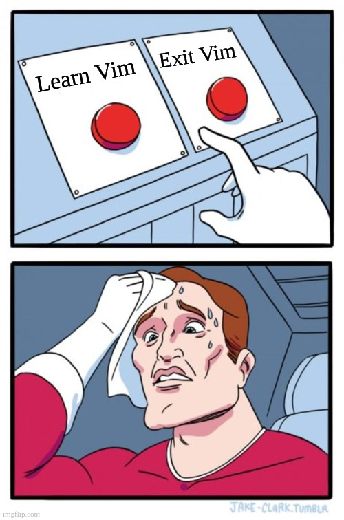

In my previous post [Inevitable Vi](https://amitashukla.in/blog/inevitable-vi/), I talked about getting started with Vi (or Vim). Since then, vim has become an integral part of my workflow. Who could have thought you'd need to open countless files across remote servers, with no fancy text editors to help? It started from there, but I gradually realised the power of Vim -- no need to lift your hand to reach over to the mouse (or trackpad) -- control everything using keyboard. Today, I look for vim anywhere I can. I use it in all my IDEs, command line, browsers, etc.

In this post, I will be discussing how I use Vim as my primary tool for editing and navigating.



## Reasons for which I use Vim
Vim has a slight learning curve. We do not realise the convenience until we try it and have developed some muscle memory. But once we adapt to the way of thinking in terms of vim commands, our life on computers becomes a little easier. We're able to keep our hands steady, our fingers find their home -- with left index on `F` and right index on `J`.
#### Freedom from learning keyboard shortcuts for every app
I have had to switch my IDEs, operating systems, text editors, browsers from time to time. A lot of times I have to alternate between these. That means -- to *really* use an application, I would need to learn each of these keyboard shortcuts - again! This is a HUGE hassle. So, I look for Vim. I use it everywhere. That way I get to remember only one set of powerful commands - and I am powerful everywhere.
#### Vim is everywhere 
Vim comes preinstalled on almost all unix systems - so basic Vim becomes a requirement anyway.
#### Navigation
Writing is different from Typing. Writing is a combination of - reading, thinking and typing. While doing that, I often find myself scrolling, navigating, and jumping around the text. The arrowkeys in a traditional laptop are too far from the letters. Having navigation possible at `H, J, K, L` solves this elgantly. Especially how the downward navigation `J`, sits right below the index finger.
#### Independence from mouse
Vim is totally keyboard-enabled. I realized early on that using mouse for minor things, like scrolling, selecting, changing tabs or screens, browsing through files etc caused a break in my overall flow.
#### Extra clipboard
To be honest, I find vim's clipboard tedious. I have to copy and paste a lot of things from a lot of places, and even when I have vim enabled everywhere, they are not synchronised with each other. This means that something copied from browser will not paste directly into my IDE using Vim. Hence, I use the system's copy-paste in insert mode. Which in turn means, I have an extra clipboard for in-app usecases!

## Common Applications to Use Vim in
- IdeaVim for Intellij or Pycharm
- Vim extension for VScode
- Vimium extention for browser (is available in chrome, firefox, brave)
- terminal keybindings for Mac and Ubuntu:
  - `set -o vi` [https://unix.stackexchange.com/questions/4870/is-it-possible-to-have-vim-key-bindings-in-terminal]
  - `bindkey -v` use vi key bindings in zsh
  - `bindkey -v '^?' backward-delete-char` avoid the annoying backspace/delete issue where backspace stops deleting characters
  - `bindkey '^R' history-incremental-search-backward` use ctrl-r to reverse search

## Common Vim Commands
- `h`, `j`, `k`, `l` left, down, up, right
- `H` move to the first visible line of the screen
- `J` join two lines
- `K` call `man` or `--help` for the word below the cursor - helpful if reading a shell script
- `L` move to last visible line of the screen
- `u` undo
- `ctrl + r` redo
- `~` toggle case of char below

## Word Navigation
- `w` move to first char of the next word (a *word* is separated by any punctuation except underscore) - used to navigate  to next word
- `b` move to the start of the current or previous word - used to navigate to previous word
- `e` move to the end of the current or next word
- `ge` move to the end of the previous word
- `W` move to first char of the next WORD (the next character after whitespace)
- `ciw` change the word where your cursor is
- `dt<char>` 
- `df<char>`
- `shift + [` and `shift + ]` Move cursor block-wise - moves cursor up and down the block of code.
- `10j` move a certain number of lines: select the number of lines when you don’t have a block of code: `shift + v + 10j` would do the trick.
- `%` toggle between 2 parentheses 
- `*` move to next occurrence of the current word
- `^` or `0w` move to beginning of the first word of the line 
- `g~w` toggle case of the whole word
- `g~it` toggle case of everything in the tag (note: the `t` works in vim but not in the vscode vim extension)

## Move to locations
- `Ctrl+o` navigate to the previous location in the jump list (think `o` as old)
- `Ctrl+i` navigate to the next location in the jump list (i and o are usually next to each other)
- `g;` go to the previous change location
- `g,` go to the newer change location
- `gi` place the cursor at the same position where it was left last time in the Insert mode

## Select - Visual Mode
- `vw` select till next word
- `ve` select till end of the current word
- `viw` select in word - select the entire word
- `v%` select the block between matching brackets
- `vit` select in tag
- `shift + v` select the current line 

## Indentation
- `==` re-indents the whole line
- `=}` indents to the next paragraph
- `=%` indents block between matching brackets
- `gg=G` indents everything in file

## Mark
- `m<char>` mark a line as `<char>`
- `'<char>` goto mark `<char>`
  
## Command mode
- `:set number` show line numbers
- `:set relativenumber number` show both line numbers relative to the cursor and line numbers

## Examples
Here are some examples (will keep adding more):
#### Surround a word with quotes (or any other character)
`c` `i` `w` `"` `"` `Esc` `P` <br/>
Replace `iw` with any other Vim motion/text object to surround other things with quotes
#### Insert an html tag in front of multiple lines (e.g. `<b>` in front of 3 lines)
`ctrl-v` `jjj` `I` `<b>` `Esc`   
#### Insert an html tag at the end of multiple lines (e.g. `</b>` at the end of 3 lines)
`ctrl-v` `jjj` `$` `A` `</b>` `Esc`

## vimrc
Add the following code to enable a blinking bar in insert mode in `~/.vimrc`. This is vimscript code. The comments start with a double quote.
```bash
if &term =~ "xterm"
  let &t_SI = "\e[6 q"   " Insert mode — bar
  let &t_EI = "\e[2 q"   " Normal mode — block
endif
```

## That doesn't mean I only use Vim
Just like my last point above, vim is an *addition* to my skills, and not a complete replacement. Maybe I am not that versed till now, but I use vim alongwith other app shortcuts to customize my workflow.
1. I still prefer using an app's built in search functionalities instead of vim. For in-file, one word, no-regex searches, sure I just press `*` on the word and search. But for sophisticated ones, I still prefer in app search.
2. Clipboard: A lot of times, system's copy-paste works for me better. So, ctrl-v is used for paste instead of visual mode.
3. I keep Sublime text vim free for times when my brain freezes (e.g. when I'm presenting something :D)

I feel this is a temporary phase though. I will slowly move towards using more and more vim. But, in the meantime, I do this to avoid undergoing a rabbit hole of vim commands while working on something else.

I'll conclude by saying -- I have a LOT more to learn. I still fumble, and keep switching to whatever feels more efficient in the moment. I haven't yet taken out the time to connect my systems around vim. My configs are far from perfect. But each improvement adds up. Every now and then I discover new and better ways of doing something. It's become a challenge I enjoy, and would encourage you to ask yourself too - "*How can I do this with Vim?*"

## References:
- https://learnbyexample.github.io/tips/vim-tip-5/
- https://vi.stackexchange.com/questions/21113/vimscript-surround-word-under-cursor-with-quotes
- https://youtu.be/RdyfT2dbt78?si=IGjmyKZnkTb7udB_
