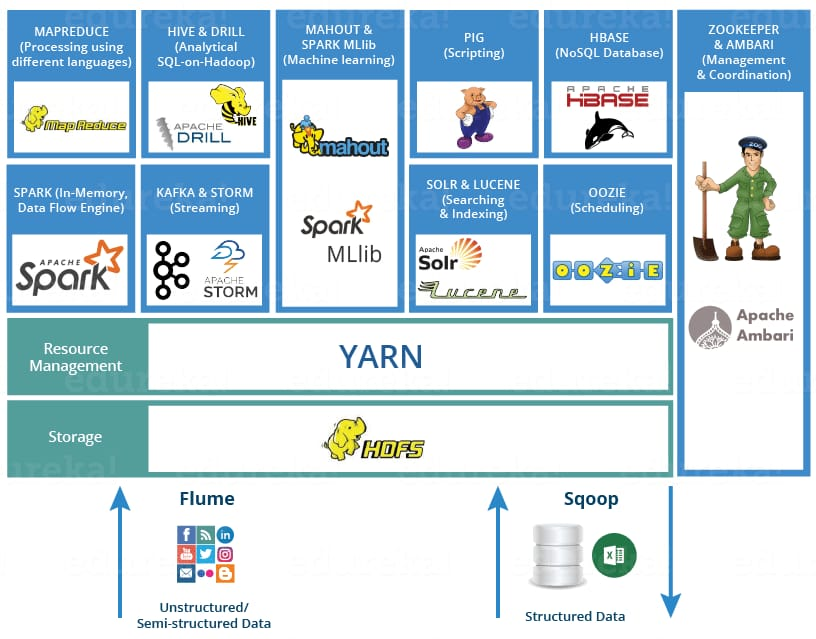
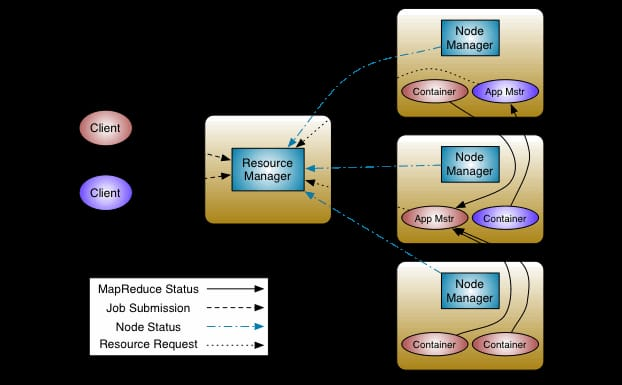

In my previous post [Foundations of Data Systems: OLTP, OLAP, and What Came Next](https://amitashukla.in/blog/data-evolution-oltp-olap/), we discussed about OLTP and OLAP systems, and how they defined the early data landscape. Organizations relied on a combination of OLTP systems for operational workloads and data warehouses for analytics. This model worked well when data was primarily structured, generated at predictable rates, and could be processed in periodic batches. 

However, the growth of the internet fundamentally changed the nature of data. Organizations were no longer dealing with just transactional records and reporting tables. Websites, mobile applications, sensors, machine logs, clickstreams, and social media platforms began generating data at unprecedented scale.

Traditional systems struggled to keep up. Storing petabytes of data on expensive proprietary hardware became impractical. ETL pipelines grew increasingly complex, and analytical queries took longer to run. At the same time, businesses wanted insights faster, often in near real time.

The challenge was no longer just managing data — it was managing massive volumes of data, arriving at high velocity, in a variety of formats, while remaining cost-effective and scalable.

This gave rise to a new generation of technologies collectively referred to as **Big Data** -- instead of relying on larger and more powerful machines, these systems embraced horizontal scaling, distributing storage and computation across clusters of commodity hardware.



## Separation of Storage and Compute

Early databases and data warehouses were built on a simple assumption: the machine storing the data would also process it. To scale a sucha a system, an organization had to scale the entire machine - where the storage and compute resources were tightly coupled.

As organizations accumulated more data, however, a fundamental problem emerged. Storage and compute rarely grew at the same rate. For example, an organization might need to retain years of historical data, requiring additional storage capacity, but the computational requirements for querying that data might remain unchanged. Conversely, a team running a complex analytical workload might need more CPU and memory for a few hours, without requiring any additional storage.

The rise of distributed storage systems and cloud object stores made it possible to decouple these concerns. Data could be stored in a shared, durable storage layer, while compute resources could be provisioned independently and scaled according to demand. One of the earliest large-scale attempts at solving this problem was **Hadoop**, which introduced a distributed architecture for storing and processing data across clusters of commodity machines. Before understanding Hadoop, however, it is worth examining the programming model that inspired much of the early Big Data ecosystem: MapReduce.

## Map Reduce

The Map Reduce Paper was released by Google in 2004, which proposed a way of distributed parallel processing. It proposes 2 operations: `map` and `reduce` (inspired from functional programming).

MapReduce or MR addressed the problem of operating on a huge amount of data at once. Instead of loading all the data at once in memory, the input data is first divided into chunks that can be individually placed into multiple workers. Then this input is processed in parallel.

Consider the word count problem: there is a file with a lot of words, and we need to find the frequency of each word.

### Solving word count without map reduce

The brute force approach of solving this problem might be that we load the file in memory, and read it word by word. Then, for each word we record the frequency in a hashtable:

```java
inputstream = read(file);
while(line = inputStream.readLine()) {
  String[] words = line.split("\\s+"); // split line by space
  foreach(word: words) {
    ht.put(word, ht.put(word, ht.getOrDefault(word, 0)+1);
  }
}
return ht;
```

This approach works well as long as the dataset can fit on a single machine. However, when the input grows to gigabytes or terabytes, a single machine quickly becomes a bottleneck. We need a way to divide the work across multiple machines and process the data in parallel.

MapReduce provides a programming model for solving exactly this problem.

Consider the following input:

```text
abc, xyz, abc, def, def, abc
```

The processing can be broken down into several phases.

### Map

Each worker processes a subset of the input and applies a `map` function. The mapper emits a key-value pair for every occurrence of a word.

```text
(abc, 1)
(xyz, 1)
(abc, 1)
(def, 1)
(def, 1)
(abc, 1)
```

Since the intermediate output may be much larger than memory, the mapper writes its output to local disk.

### Combiner (Optional)

Before sending data across the network, a mapper can perform a local aggregation using a combiner.

Suppose two mappers produce the following output:

```text
Mapper 1:
(abc, 1)
(xyz, 1)
(abc, 1)

Mapper 2:
(def, 1)
(def, 1)
(abc, 1)
```

A combiner running on each mapper may produce:

```text
Mapper 1:
(abc, 2)
(xyz, 1)

Mapper 2:
(def, 2)
(abc, 1)
```

This reduces the amount of data that needs to be transferred during the shuffle phase. Note that combiners perform local aggregation only; they do not produce the final result.

### Shuffle and Sort

The framework now groups all values belonging to the same key.

First, intermediate data is sorted by key. If the data is too large to fit in memory, external sorting is performed and intermediate results are written to disk.

The framework then partitions the data and routes each key to a reducer. A partitioner function ensures that the same key always goes to the same reducer.

For example, with two reducers:

```text
Reducer 1:
(abc, [2, 1])

Reducer 2:
(def, [2])
(xyz, [1])
```

This shuffle phase is often the most expensive part of a MapReduce job because it involves disk I/O, sorting, and network transfer between machines.

### Reduce

Each reducer receives all values associated with a key and applies an aggregation function.

```text
(abc, 3)
(def, 2)
(xyz, 1)
```

The final output is then written back to distributed storage (typically HDFS).

The beauty of MapReduce is that the developer only needs to define the `map()` and `reduce()` functions. The framework takes care of data distribution, scheduling, fault tolerance, sorting, shuffling, and aggregation.

```text
Input
  ↓
Map
  ↓
Combiner (optional)
  ↓
Shuffle & Sort
  ↓
Reduce
  ↓
Output
```

This is how the code looks like in Java (I know it's verbose, but like a typical java code, a lot of it is boilerplate):

```java
public class WordCount {

  public static class TokenizerMapper
       extends Mapper<Object, Text, Text, IntWritable>{

    private final static IntWritable one = new IntWritable(1);
    private Text word = new Text();

    public void map(Object key, Text value, Context context
                    ) throws IOException, InterruptedException {
      StringTokenizer itr = new StringTokenizer(value.toString());
      while (itr.hasMoreTokens()) {
        word.set(itr.nextToken());
        context.write(word, one);
      }
    }
  }

  public static class IntSumReducer
       extends Reducer<Text,IntWritable,Text,IntWritable> {
    private IntWritable result = new IntWritable();

    public void reduce(Text key, Iterable<IntWritable> values,
                       Context context
                       ) throws IOException, InterruptedException {
      int sum = 0;
      for (IntWritable val : values) {
        sum += val.get();
      }
      result.set(sum);
      context.write(key, result);
    }
  }

  public static void main(String[] args) throws Exception {
    Configuration conf = new Configuration();
    Job job = Job.getInstance(conf, "word count");
    job.setJarByClass(WordCount.class);
    job.setMapperClass(TokenizerMapper.class);
    job.setCombinerClass(IntSumReducer.class); // same as reducer, but runs aggregation locally on the output of each mapper
    job.setReducerClass(IntSumReducer.class);
    job.setOutputKeyClass(Text.class);
    job.setOutputValueClass(IntWritable.class);
    FileInputFormat.addInputPath(job, new Path(args[0]));
    FileOutputFormat.setOutputPath(job, new Path(args[1]));
    System.exit(job.waitForCompletion(true) ? 0 : 1);
  }
}
```
PS: to sort the rows by count desc in the above program, you would need to:

- write a custom output class, e.g. `WordCountPair` as the key class, and then redefine sorting method.
- change the mapper: `TokenizeMapper extends Mapper<Object, Text, WordCountPair, NullWritable> {`
- change the reducer: `IntSumReducer extends Reducer<WordCountPair, NullWritable, Text, IntWritable> {`
- set:
```java
job.setMapperClass(TokenizeMapper.class);
job.setCombinerClass(IntSumReducer.class);
job.setReducerClass(IntSumReducer.class);
job.setMapOutputKeyClass(WordCountPair.class);
job.setMapOutputValueClass(NullWritable.class);
job.setOutputKeyClass(Text.class);
job.setOutputValueClass(IntWritable.class);
```
- and run:
```bash
hadoop jar wordcount.jar WordCount /input /output
```

### How to solve common problems with MR?

Conventional problems are not designed around memory independence. e.g. aggregations over millions of rows, one one hand DBMS would be resource intensive, MR can be quicker. 

MR is useful where stateless operations can be performed on rows:

- `select + where` pattern, e.g. count number of people > age 30
- joins
- aggregation functions

Word count is one of the simplest examples of MapReduce, but the same pattern can be applied to a wide range of large-scale data processing problems such as log analysis, inverted index generation, sessionization, joins, aggregations, and recommendation systems.

## Hadoop

While MapReduce defined how large-scale data processing could be expressed, it did not define where the data would live or how the computation would be orchestrated across a cluster. These challenges were addressed by Hadoop, an ecosystem that brought together distributed storage and distributed computation into a single platform.

The project includes these modules:

- **Hadoop Common**: The common utilities that support the other Hadoop modules.
- **Hadoop Distributed File System (HDFS™)**: A distributed file system that provides high-throughput access to application data.
- **Hadoop YARN**: A framework for job scheduling and cluster resource management.
- **Hadoop MapReduce**: A YARN-based system for parallel processing of large data sets.

Hadoop splits files into large blocks and distributes them across nodes in a cluster. It then transfers packaged code into nodes to process the data in parallel. This approach takes advantage of data locality where nodes manipulate the data they have access to.

## HDFS
Distributed file system designed to run on commodity hardware. That means it is highly fault tolerant and deployed on low-cost hardware.


- It is a master slave architecture - an HDFS cluster is made of **NameNode** and **DataNodes**.
- HDFS exposes a filesystem, namenode executes the fs operations. a user can upload a file to it using it.
- Internally, the file gets divided into one or more **blocks** and these blocks are stored in a set of datanodes. Namenode maintains the mapping of blocks to datanodes. The blocks are replicated for fault tolerance. Default HDFS block size is 128 MB.
- Files in HDFS are write-once (except for appends and truncates) and have strictly one writer at any time.
- The NameNode makes all decisions regarding replication of blocks. It periodically receives a **Heartbeat** and a **Blockreport** from each of the DataNodes in the cluster. Receipt of a Heartbeat implies that the DataNode is functioning properly. A Blockreport contains a list of all blocks on a DataNode.
- **Rack Awareness for replica placement** - For the common case, when the replication factor is three, HDFS’s placement policy is to put
    - one replica on the local machine if the writer is on a datanode, otherwise on a random datanode in the same rack as that of the writer,
    - another replica on a node in a different (remote) rack, and
    - the last on a different node in the same remote rack.
    
    This policy cuts the inter-rack write traffic which generally improves write performance. The chance of rack failure is far less than that of node failure.

## YARN

YARN is a resource allocator/ manager and job scheduler integrated with hadoop. It allocates resources for running jobs in Hadoop.

### Components of Yarn



- ResourceManager: Master node that manages global resource allocation.
- NodeManager: Slave node that monitors resources on individual nodes.
- ApplicationMaster: Manages lifecycle of each individual application/job.

YARN is still used in Hadoop-based workloads but its popularity has declined due to:

1. Rise of Cloud: Cloud-native solutions like Kubernetes manage resources better.
2. Spark on Kubernetes: Spark workloads now often run directly on Kubernetes, bypassing YARN.
3. Shift to Modern Data Architectures: Adoption of cloud warehouses (e.g., Snowflake) and serverless platforms reduces reliance on Hadoop ecosystems.

While still relevant in legacy Hadoop deployments, **YARN is no longer as dominant as before**.

## Hadoop is just the beginning 
The emergence of Big Data marked a fundamental shift in how organizations approached data processing. Instead of relying on increasingly powerful machines, systems began embracing clusters of commodity hardware, distributing both storage and computation across hundreds or thousands of nodes. Concepts such as horizontal scaling, fault tolerance, data locality, and parallel processing became first-class citizens in data architecture.

At the heart of this movement was the Hadoop ecosystem. HDFS provided distributed storage, MapReduce offered a model for large-scale computation, and YARN enabled efficient resource management across a cluster. Together, these technologies laid the foundation for processing datasets that were simply too large for traditional systems to handle economically.

However, Hadoop was only the beginning. As data workloads evolved, organizations demanded faster processing, more familiar interfaces, and better support for interactive analytics. This led to the rise of a rich ecosystem of tools built on top of Hadoop—bringing SQL, real-time processing, machine learning, and improved developer productivity to the world of Big Data.
