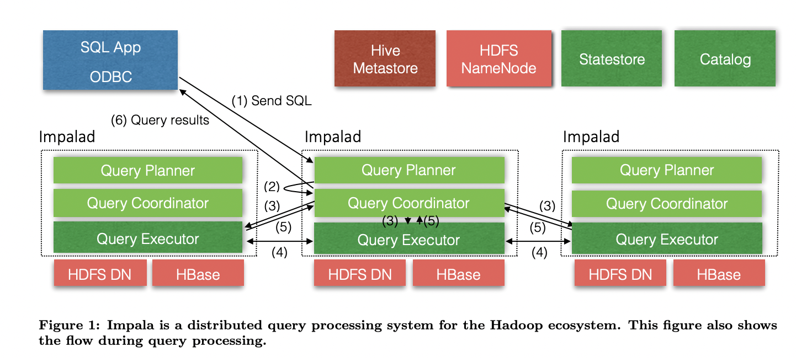

Consider the word count example from my previous post [](). The problem is simple: Count the frequency of each unique word in a huge file. We solved the problem using MapReduce, which made it solvable efficiently. 

However, coding this problem as an MR job was cumbersome. An MR job written in Java contains:
- Mapper
- Reducer
- Driver
- Configurations settings
- Jar
- Submit Job

Consider the word count problem modelled on a relational table. The words can be saved into a table in postgres, `lines_table`, containing each row as a line in the table, the column being `lines`. Then the below code is all that would be needed to run on Postgres:
```sql
SELECT word, COUNT(*) AS count
FROM (
  SELECT unnest(string_to_array(lines, ' ')) AS word
  FROM lines_table
) AS words
GROUP BY word
ORDER BY count DESC;
```

With Hadoop, a SQL query earlier run by a business analyst now needed a software engineer to write and deploy the same job. Hence, as Hadoop adoption grew, there was a strong demand for a SQL interface on top of distributed data.
This problem gave rise to **Hive — sql for Hadoop**, and **Pig — scripting for hadoop**.

## Hive - SQL translated into map reduce

Hive is essentially a data warehouse with HiveQL or **HQL** -- a sql like interface to query HDFS data.

Hive allowed organizations to define a schema to their underlying data and run SQL queries on data, while offloading the headache of running MR job to Hive itself. The Hive compiler would generate MapReduce jobs behind the scenes.

Though Hive is used for structured data, it seamlessly integrated with other bigdata pipelines. Currently it uses MapReduce, Tez or Spark for query execution. Modern Hive running on spark / tez is much faster than classic Hive.

### Some Hive Features
- supports JDBC/ODBC drivers.
- best for batch processing and ETL jobs.
- Relies on metastore for schema storage. This is a relational database (e.g. MySQL, PostgreSQL, or Derby (embedded)).
- The Hive metastore is moved on to become an important entity in itself. A number of other tools that use the Hive Metastore include:
    1. Impala - For fast SQL queries.
    2. Spark SQL - For structured data processing.
    3. Presto/Trino - For distributed SQL queries.
    4. AWS Athena - For serverless querying of S3 data.
    5. Flink - For batch and stream processing.
    6. Airflow - For managing Hive workflows.

Here's how a word count program would look like in Hive:
```sql
# create managed table
CREATE TABLE input_tbl (
    line string # create a table to load input data in hive having a single column 'line' of type string
)
ROW FORMAT DELIMITED # DELIMITED -> simple formats, SERDE -> json, avro, STORED BY -> external storage e.g. HBase
LINES TERMINATED BY '\n' 
STORED AS parquet;

# text data gets converted to parquet format, or can use LOCATION clause in create query, but the data format of the undelying file must be same.
# data gets moved to hive managed dir, by default /user/hive/warehouse/
LOAD DATA INPATH '/hdfs/input/lines.txt' INTO TABLE input_tbl;

# query
CREATE TABLE word_count AS
    SELECT word, COUNT(1) as count FROM	  
        (SELECT EXPLODE(SPLIT(line, '\\s')) AS word FROM input_tbl) temp_tbl # EXPLODE converts a list in the same row to multiple rows
    GROUP BY word
    SORT BY count DESC;
```

- 2 types: Managed and EXTERNAL tables. In a managed table, data gets deleted when the corresponding table is deleted.

## Pig

What hive is for structured data, Pig is for un/semi-structured data. 

Pig uses a procedural language PigLatin. It is a scripting language for describing operations like reading, filtering, transforming, joining and writing data. It runs map reduce jobs underneath.

```bash
input = LOAD '/tmp/admin/Twitterdata.txt' AS (line:chararray);
words = FOREACH input GENERATE FLATTEN(TOKENIZE(line, ' ')) AS word;
grouped = GROUP words by word;
output = FOREACH grouped GENERATE group, COUNT(words);
STORE output INTO '/tmp/admin/pig_wordcount';
```

> As of 2020: “Note for current readers: Pig has not seen much innovation and is considered deprecated by many.”

### Impala

While Hadoop and Hive won over traditional data warehouses over scale, flexibility and cost, Hive was still slow. The ecosystem spent the next decade trying to recover the performance and usability that the traditional data warehouses had. 

While Hive was excellent to run ETL jobs that can run nightly over very high amounts of data, each Hive query job required a lot of setup overhead:
- Submit query
- Generate MR job
- Launch containers
- Read data
- Aggregate
- Return Result


Impala was created to address a different problem: __what if users want answers in seconds instead of minutes?__ 

### Impala Architecture

Instead of translating SQL into MapReduce jobs, Impala executes SQL queries directly on the cluster, allowing users to explore large datasets with response times measured in seconds rather than minutes.

It uses **Massively Parallel Processing (MPP)** - used by Redshift, Bigquery, Snowflake as well.


When a query arrives:
- A coordinator node parses and optimizes the query.
- The query plan is split into fragments.
- Fragments are distributed to worker nodes (`impalad` daemons).
- Each node processes its local data in parallel.
- Partial results are exchanged and aggregated.
- Final results are returned to the client.

Key characteristics:
- Long-running daemons (no job startup overhead)
- Distributed query execution
- Data locality
- Pipelined execution
- Heavy use of memory
- MPP-style parallelism

### Modern Hive v/s Impala

Modern Hive is much faster than classic Hive.
Both have created their own space in the big data world. The distinction today is less about speed and more about workload type:
| Hive                   | Impala                 |
| ---------------------- | ---------------------- |
| ETL platform           | Interactive SQL engine |
| Data transformation    | BI & analytics         |
| Scheduled workloads    | Ad-hoc workloads       |
| Heavy batch processing | Fast querying          |

Think of a data warehouse team.
- Hive : "Generate yesterday's sales report for all countries and store it”. Runs every night.
- Impala: "Show me today's sales for Europe right now”. Analyst waiting at a dashboard.

Users commonly use Hue to run Impala queries.

## Hue

Hue is the SQL workbench for optimised, interactive query design and data exploration. Hue is a UI to interact with hadoop tools. It allows user to write queries, using SQL engines like Hive, Impala or Presto (now maintained as trino).
