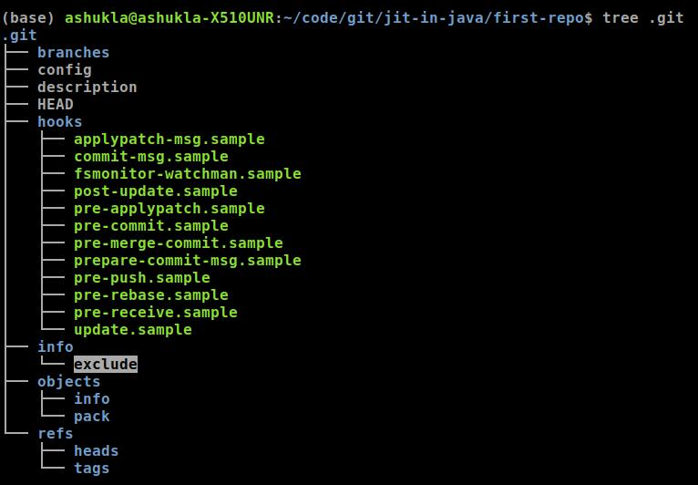

If you have files that you wish not to be tracked by git, you need to inform git about it. There are 2 ways to do that:

1. One is by creating a file named `.gitignore`, and adding the path of the file you wish to ignore on it.
2. The other is by appending the file path in file: `.git/info/exclude`

The difference between these two is that the `.gitignore` file is part of your source tree, i.e. it is meant to committed and shared across all the clones. So the patterns mentioned in `.gitignore` will be applicable to all the developers working on the code.

But for some reason you have a file that you wish to only ignore *locally*, i.e. you do not want the changes you make to these files be tracked, you should add them in `.git/info/exclude`.