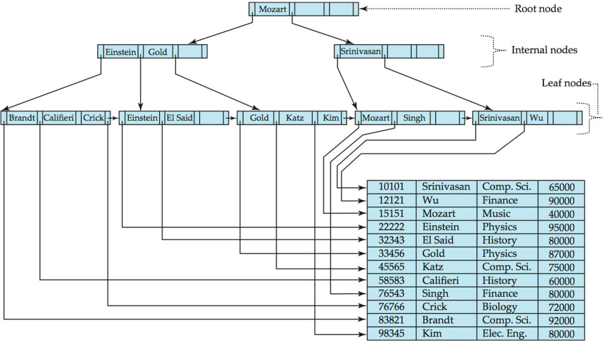

These are my notes from the book [Database Performance](https://use-the-index-luke.com/sql/table-of-contents) [Chapter 1](https://use-the-index-luke.com/sql/anatomy) by Markus Winand. I found this book fairly simple to read, and it's for free!

## Anatomy of an Index
- Creating an index does not change the table data; it just creates a new data structure that refers to the table.
- Searching in a database index is like searching in a printed telephone directory. A database index is, however, more complex than a printed directory because it undergoes constant change. It must process insert, delete and update statements immediately, keeping the index order without moving large amounts of data.

### The Index Leaf Nodes
- The logical order of rows is established via a doubly linked list, so on insertion of new rows, their physical order will not matter and only the pointers to the previous and next nodes need to be moved. It is thus possible to insert new entries without moving large amounts of data—it just needs to change some pointers.
- Each leaf node is saved in a page (or block). Each leaf node will contain the keys in sorted order. Each key here will point to the physical location of the row in table. These leaf nodes saved on blocks are saved in ordered form as well.
- While the above ordering is maintained in indexes, note that in tables these rows have no connection to each othere and exist in insertion order.

[Image-Source](https://blog.yugabyte.com/a-busy-developers-guide-to-database-storage-engines-the-basics/)

### The B-tree makes the Index Fast
- A B-tree is maintained for a quick search of keys.
- The doubly linked list establishes the logical order between the leaf nodes. The root and branch nodes support quick searching among the leaf nodes.
- A B-tree is a balanced tree, not a binary tree.
- Due to this a search is possible in O(logn) time, and the tree balance allows accessing all elements with the same number of steps.
- That means that the tree depth grows very slowly compared to the number of leaf nodes. Real world indexes with millions of records have a tree depth of four or five. A tree depth of six is hardly ever seen.

### Slow Indexes - Part 1
- An index not only involves the tree traversal (which has an upperbound of the tree depth), it also involves:
    a. traversing the leaf nodes in case the key is not unique, and
    b. table access.
These can cause an index to slow down.